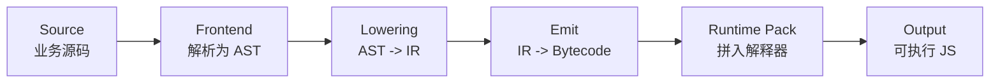

# 从零构建寄存器式 ScriptVM：教程导读

## 这套教程要解决的，不是“知道名词”，而是“把整条链路真正接起来”

这组文档的目标很明确：带你亲手做出一条最小但完整的 ScriptVM 主链路。输入是一段普通 JavaScript，输出是一段带有字节码和解释器的自包含脚本。我们关注的不是抽象名词堆砌，而是下面这条工程事实：

> `ScriptVM = 编译器 + 字节码协议 + 运行时解释器`

只有这三部分对齐，源码语义才会在 VM 中被正确重建。

---

## 先看全景地图：我们到底在造哪台机器



这张图有两个作用：

- 它告诉我们，教程不是只讲 VM，也不是只讲 AST，而是讲“从源码到执行结果”的闭环。
- 它提前划清了章节边界。后面每一章都只负责其中一段，不会把所有复杂度一次性堆给读者。

---

## 先把四组核心概念分开

### 1. 编译阶段的四层表示各自负责什么

| 层次 | 典型形态 | 解决的问题 |
|------|----------|------------|
| Source | `var x = 40 + 2` | 人写出来的业务逻辑 |
| AST | 树状节点对象 | 代码“长什么样” |
| IR | 线性指令对象 | 代码“按什么顺序做” |
| Bytecode | 数字数组 | VM “如何高效读取” |

### 2. 运行时的三类存储位置各自负责什么

| 概念 | 典型例子 | 职责 |
|------|----------|------|
| Register | `r0`, `r1`, `r2` | 存表达式计算中的临时结果 |
| Slot | `slot0`, `slot1` | 存变量绑定对应的稳定位置 |
| Env | `env.values`, `env.parent` | 把一组 slot 组织成作用域链 |

这组边界需要尽早建立，因为后面的闭包、提升、TDZ，本质上都依赖于它。

---

## 为什么这条路线值得按顺序学

寄存器式 ScriptVM 的难点并不在某一段代码特别长，而在于每一层都要与上下游保持一致：

- `lowering` 必须知道运行时怎样找变量。
- `emit` 必须知道每条 IR 会被编码成几个数字。
- `runtime` 必须知道这些数字怎样精确推进 `pc`、修改 `regs`、读写 `env`。

因此，这套教程采用“先整机、再零件、再连线”的顺序：

1. 先理解整条编译执行链。
2. 再设计能承载语义的指令集。
3. 然后把 AST 降成 IR。
4. 最后把 IR 编成字节码并交给运行时执行。

这种顺序的价值在于：每一章都在回答一个明确的问题，而不是把多个抽象层同时展开。

---

## 教程地图：每一章分别解决什么问题

| 阶段 | 文件 | 核心论点 |
|------|------|----------|
| 00 | `00-tutorial-guide.md` | 先建立全链路心智模型，再进入细节 |
| 01 | `01-architecture-overview.md` | 先搭整机视图，后面代码才有坐标 |
| 02 | `02-instruction-set-design.md` | 指令集决定编译器和运行时能否稳定对齐 |
| 03 | `03-compiler-ast-to-ir.md` | AST 负责表达结构，IR 负责表达执行顺序 |
| 04 | `04-emit-and-runtime.md` | 只有把 IR 压成数字并跑起来，系统才真正闭环 |
| 05 | `05-es5-core-features.md` | 闭包、`this`、`arguments` 与作用域语义决定 VM 是否像 JavaScript |
| 06 | `06-testing-and-debugging.md` | 能持续验证语义一致性，系统才具备演进能力 |

---

## 建议的阅读与动手方式

### 先读什么

建议按章节顺序阅读，因为术语和模型会逐章复用。尤其是以下几组关系：

- `register` 与 `slot` 的分工
- `AST` 与 `IR` 的职责差异
- 编译期作用域与运行时 `env.parent` 的同构关系

### 先跑什么

仓库已经为教程准备了最小脚手架，建议一边阅读，一边运行这些示例：

```bash
node docs/examples/tutorial-jsvm/01-handwritten-register-vm.js
node docs/examples/tutorial-jsvm/02-slots-and-env.js
node docs/examples/tutorial-jsvm/03-ast-to-ir.js
node docs/examples/tutorial-jsvm/04-emit-bytecode-and-run.js
node docs/examples/tutorial-jsvm/05-closure-runtime.js
node docs/examples/tutorial-jsvm/05-this-and-arguments.js
node docs/examples/tutorial-jsvm/06-test-your-mini-jsvm.js
```

### 先记什么

建议把下面四句话当成整套教程的导航：

1. AST 解决“语法结构”，IR 解决“执行顺序”。
2. Register 保存“临时结果”，Slot 保存“变量绑定”。
3. Env 是运行时版本的作用域链。
4. Bytecode 是运行时消费的数字协议，不是给人阅读的源码。

---

## 教程版脚手架与正式工程实现的关系

教程里的示例文件位于 `docs/examples/tutorial-jsvm/`，它们的定位是“教学版施工脚手架”：

- 每一步只引入当前章节最需要的能力。
- 示例代码尽量短，便于你看清状态变化。
- 正式工程中的 `src/compiler/*` 和 `src/runtime/*` 会更完整，但底层思路保持一致。

也就是说，教程不是在复述仓库源码，而是在搭一座桥：先用最小模型讲清楚原理，再把这些原理映射回正式实现。

---

## 读完整套教程后，你应该能回答什么

如果这套教程真正起效，读完以后你至少应该能独立回答下面几个问题：

1. 为什么 AST 不能直接交给 VM 执行？
2. 为什么变量名不会直接出现在字节码里，而会变成 `slot + depth`？
3. 为什么闭包捕获的是环境引用，而不是某个变量当下的值？
4. 为什么 VM 中最难查的 bug，往往是状态错位，而不是算法错误？

后面的每一章，都会围绕这四个问题继续展开。
