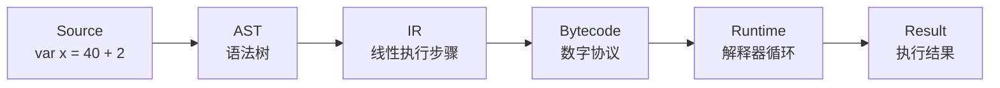

# 为什么先搭整机视图，而不是立刻写解释器？

## 本章目标

这一章要先把“机器全貌”搭出来。读完以后，你应该能回答：

1. `JSVM`、`ScriptVM`、编译器、解释器之间是什么关系？
2. 一段普通 JavaScript 进入系统后，会依次经历哪些形态？
3. 为什么本项目选择寄存器机，而不是栈机？
4. `register`、`slot`、`env` 为什么必须分离？

---

## 先看整机：一段源码在系统里的生命周期



这条流水线说明了一件事：ScriptVM 不是“把源码塞进一段混淆代码里”，而是把源码翻译成另一套执行协议，再由内嵌虚拟机解释执行。

> 更精确地说，`ScriptVM = 编译期翻译 + 运行时重放语义`。

---

## 为什么 VM 的核心，其实只是一个状态机

先看最小解释器骨架：

```js
function run(program) {
  const regs = []
  const code = program.bytecode
  let pc = 0

  while (pc < code.length) {
    const op = code[pc++]

    switch (op) {
      case OPCODES.LOAD_CONST:
        // ... 读操作数，写寄存器 ...
        break
      case OPCODES.BINARY:
        // ... 取寄存器，做运算，写回结果 ...
        break
      case OPCODES.RETURN:
        // ... 结束并返回 ...
        break
    }
  }
}
```

这段代码足以暴露 VM 的三件基础事实：

- `pc` 负责指出“下一条指令从哪里开始读”。
- `regs` 负责保存表达式求值过程中的中间结果。
- `switch(op)` 负责把数字协议还原成真实动作。

从架构角度看，VM 的本质并不神秘。真正的难点在于：编译器输出的协议，必须和这个状态机逐项对齐。

---

## 为什么 AST 之后还要有 IR 这一层

先看同一段代码在两种表示下的差异：

### 源码

```js
var x = 40 + 2;
__result = x;
```

### AST 视角：强调“结构”

```json
{
  "type": "VariableDeclaration",
  "declarations": [
    {
      "id": { "name": "x" },
      "init": {
        "type": "BinaryExpression",
        "left": { "type": "NumericLiteral", "value": 40 },
        "right": { "type": "NumericLiteral", "value": 2 }
      }
    }
  ]
}
```

### IR 视角：强调“顺序”

```text
load_const   r0, 40
load_const   r1, 2
binary       r2, r0, r1, +
init_slot    slot0, r2
load_slot    r3, slot0
store_global "__result", r3
```

两者都重要，但职责不同：

| 表示层 | 擅长表达什么 | 不擅长表达什么 |
|--------|--------------|----------------|
| AST | 源码的嵌套结构 | 线性执行顺序 |
| IR | 逐步执行的动作序列 | 高层语法层次 |

这也是本系列教程把“AST -> IR”单独拿出来讲的原因。

---

## 为什么这里选择寄存器机，而不是栈机

同样是计算 `40 + 2`，两类 VM 的指令风格完全不同。

### 栈机：中间结果隐含在栈顶

```text
PUSH 40
PUSH 2
ADD
```

### 寄存器机：中间结果显式落在目标位

```text
LOAD_CONST r0, 40
LOAD_CONST r1, 2
BINARY     r2, r0, r1, +
```

本项目选择寄存器机，不是因为它“更高级”，而是因为它更贴合 lowering 的输出习惯：

- AST 展平之后会自然产生大量临时值。
- 这些临时值在寄存器模型里可以拥有稳定编号。
- 当控制流、函数调用、对象访问逐步加入后，寄存器式 IR 更容易检查和调试。

### 两种模型的对比

| 维度 | 栈机 | 寄存器机 |
|------|------|----------|
| 中间结果位置 | 隐含在栈顶 | 显式写在目标寄存器 |
| 指令长度 | 通常更短 | 通常更长 |
| 可读性 | 需要追踪栈变化 | 直接看到数据流向 |
| 调试体验 | 更依赖心算 | 更适合打印状态 |

---

## 为什么变量不能直接“住在寄存器里”

从执行角度看，表达式结果和变量绑定是两类完全不同的东西。

| 概念 | 作用 | 生命周期 |
|------|------|----------|
| Register | 保存临时计算结果 | 通常只覆盖当前表达式 |
| Slot | 保存变量绑定对应的位置 | 伴随作用域存活 |
| Env | 管理一组 slot，并串成作用域链 | 伴随函数/块级作用域存活 |

可以把它们理解成三种不同的存储设施：

- `register` 是桌面便签，适合临时放中间结果。
- `slot` 是编号抽屉，适合保存变量绑定。
- `env` 是整组抽屉组成的文件柜，负责向外层作用域链接。

这组分层会直接决定后面如何实现闭包与提升。

---

## 编译期和运行时为什么必须保持同构

编译器在 lowering 阶段会算出一个变量应该如何被访问：

```text
load_slot dst=r4 depth=1 slot=0
```

这条指令其实已经携带了运行时假设：

- 当前函数的环境不是目标环境。
- 需要沿着 `env.parent` 向外走 1 层。
- 到达目标环境后，从 `slot0` 读取值。

因此，编译器里的作用域分析和运行时里的环境链必须描述同一件事。它们不是“相似”，而是“同构”。

一旦两者对不齐，就会出现这类问题：

- 编译期认为变量在外层，运行时却找错了层级。
- 编译期把某个绑定当成可读，运行时却仍处于未初始化状态。

---

## 从最小示例看整机如何第一次跑通

教程第一步对应的配套文件是：

- `docs/examples/tutorial-jsvm/01-handwritten-register-vm.js`

它只做一件事：用 `LOAD_CONST`、`BINARY`、`RETURN` 三种指令跑通 `40 + 2`。

```js
const program = {
  constants: [40, 2],
  bytecode: [
    OPCODES.LOAD_CONST, 0, 0,
    OPCODES.LOAD_CONST, 1, 1,
    OPCODES.BINARY, 2, 0, 1, BINARY_OPS.ADD,
    OPCODES.RETURN, 2,
  ],
}
```

这个例子之所以重要，不在于它功能多，而在于它第一次把下面四个零件同时摆上桌面：

1. 指令协议
2. 运行时状态
3. 字节码输入
4. 返回出口

后面的章节，都是在这个最小框架上逐步补语义能力。

---

## 本章小结

这一章真正要建立的是“坐标系”：

- ScriptVM 是一条完整的编译执行流水线，不是单点技巧。
- AST、IR、Bytecode、Runtime 各自负责不同层次的问题。
- 寄存器机更适合承载 lowering 之后的线性步骤。
- `register / slot / env` 的边界，是后续所有运行时语义的基础。

带着这套坐标再进入下一章，指令集就不再只是“列一张 opcode 表”，而会成为连接编译器与运行时的协议层。
