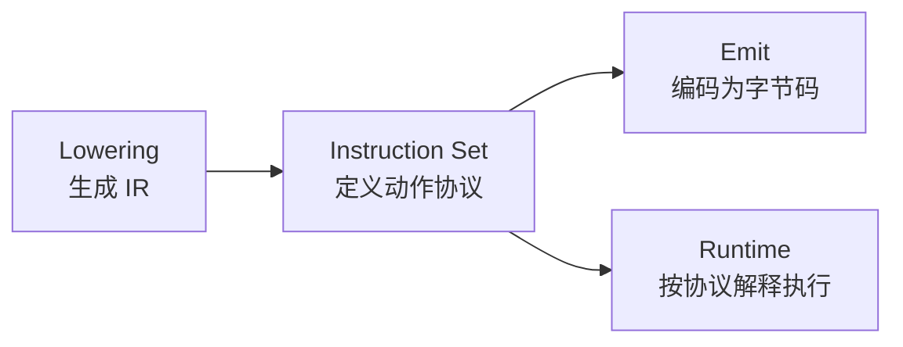

# 为什么先设计指令集，编译器和运行时才能稳定对齐？

## 本章目标

这一章的任务是把“协议层”设计清楚。读完以后，你应该能回答：

1. 一条 VM 指令由哪些部分组成？
2. 为什么不能简单地“一个语法点对应一个 opcode”？
3. `register`、`slot`、`constant pool` 为什么必须分离？
4. 为什么 `INIT_SLOT` 与 `STORE_SLOT` 要从一开始就分开？

---

## 先看地图：指令集在整条链路中的位置



指令集不是实现细节，而是编译器和运行时共享的一份合同：

- `lowering` 依赖它决定“我能发出哪些动作”。
- `emit` 依赖它决定“这些动作如何编码”。
- `runtime` 依赖它决定“数字该怎么解释”。

因此，指令集一旦混乱，三个阶段会一起变得难以维护。

---

## 为什么“一个语法点一个 opcode”不是好设计

JavaScript 的语法种类很多，但 VM 需要的不是“语法名录”，而是“可组合的基础动作”。例如：

```js
var x = 40 + 2;
```

从源码角度看，它是“变量声明 + 二元表达式”；从 VM 角度看，它只需要拆成下面几步：

```text
load_const  r0, 40
load_const  r1, 2
binary      r2, r0, r1, +
init_slot   slot0, r2
```

也就是说，高层语法会在 lowering 阶段被拆开，而底层 opcode 更适合围绕“最小动作”设计。

### 更稳的设计思路

| 类别 | 代表指令 | 作用 |
|------|----------|------|
| 加载类 | `LOAD_CONST` `LOAD_SLOT` `LOAD_GLOBAL` | 把值加载到寄存器 |
| 存储类 | `INIT_SLOT` `STORE_SLOT` `STORE_GLOBAL` | 把寄存器结果写回某处 |
| 运算类 | `BINARY` `UNARY` | 在寄存器之间做计算 |
| 控制流 | `JUMP` `JUMP_IF_FALSE` `RETURN` | 改变执行路径 |

这类分层的好处是：语法可以继续扩，底层协议不必同步膨胀。

---

## 一条指令到底由什么组成

先看最小例子：

```text
LOAD_CONST r0, 3
```

它至少包含两部分：

| 组成部分 | 含义 |
|----------|------|
| `opcode` | 做什么 |
| `operand` | 对谁做、结果放哪、额外参数是什么 |

编码以后，同一条指令可能变成：

```text
[1, 0, 3]
```

这里的关键不在数字本身，而在“读写规则必须一致”：

- `emit` 写入几个数字
- `runtime` 就必须按同样顺序读出几个数字

这也是为什么指令宽度要尽早固定。否则运行时的 `pc` 很容易错位。

---

## 为什么 `register`、`slot`、`constant pool` 要分离

第二章第一次把变量系统补上后，最容易混淆的就是这三类存储位置。

| 概念 | 典型内容 | 负责的问题 |
|------|----------|------------|
| Register | `r0`, `r1`, `r2` | 当前表达式算到了哪里 |
| Slot | `slot0`, `slot1` | 某个变量绑定住在哪里 |
| Constant Pool | `40`, `2`, `"__result"` | 字节码中会重复引用哪些常量 |

三者分离后，系统会得到三个直接收益：

1. 表达式求值不必和变量绑定耦合。
2. 字节码不必反复内嵌相同字面量。
3. 运行时的数据流与环境模型可以各自演进。

---

## 为什么 `INIT_SLOT` 和 `STORE_SLOT` 不能合并

这两个动作表面都像“往 slot 写值”，但语义完全不同：

| 指令 | 语义时机 | 后续扩展价值 |
|------|----------|--------------|
| `INIT_SLOT` | 绑定第一次被初始化 | 为 `let` / `const` / TDZ 留出状态位 |
| `STORE_SLOT` | 已存在绑定被再次赋值 | 为可变绑定建立正常写路径 |

教程第二步对应的示例文件是：

- `docs/examples/tutorial-jsvm/02-slots-and-env.js`

里面最关键的不是 opcode 数量，而是变量写入被拆成了两个阶段：

```js
function writeSlot(env, slot, value, isInit) {
  if (isInit) {
    env.values[slot] = value
    env.states[slot] = 1
    return value
  }

  if (!env.states[slot]) {
    throw new Error(`slot ${slot} is not initialized`)
  }

  env.values[slot] = value
  return value
}
```

这段代码体现的是“状态机”思维，而不是“赋值就是覆盖”的直觉式实现。

---

## 第二章的最小成果：让变量第一次拥有自己的位置

教程示例中，下面这段源码：

```js
var x = 40 + 2;
__result = x;
```

会被手工写成如下 `program`：

```js
const program = {
  slotCount: 1,
  constants: [40, 2, '__result'],
  bytecode: [
    OPCODES.LOAD_CONST, 0, 0,
    OPCODES.LOAD_CONST, 1, 1,
    OPCODES.BINARY, 2, 0, 1, BINARY_OPS.ADD,
    OPCODES.INIT_SLOT, 0, 2,
    OPCODES.LOAD_SLOT, 3, 0,
    OPCODES.STORE_GLOBAL, 2, 3,
    OPCODES.RETURN, 3,
  ],
}
```

如果按“执行视图”观察，它对应的是一条非常清晰的流水线：

| 步骤 | 指令 | 状态变化 |
|------|------|----------|
| 1 | `LOAD_CONST r0, 40` | 把常量放进寄存器 |
| 2 | `LOAD_CONST r1, 2` | 再准备第二个操作数 |
| 3 | `BINARY r2, r0, r1, +` | 得到临时结果 |
| 4 | `INIT_SLOT slot0, r2` | 把变量 `x` 初始化到环境中 |
| 5 | `LOAD_SLOT r3, slot0` | 把变量值取回寄存器 |
| 6 | `STORE_GLOBAL "__result", r3` | 把结果写回宿主对象 |

这里最关键的结构变化是：变量值第一次不再“寄宿”于寄存器，而是进入了 `env.values[slot]`。

---

## 指令集设计时，应该优先守住哪些原则

### 原则一：让运行时读取规则尽可能稳定

指令的编码规则一旦固定，`pc` 才能可预测地推进。

### 原则二：让高层语义拆成少量可复用动作

这样 lowering 才不会和 opcode 表一起失控膨胀。

### 原则三：为后续语义提前留接口

`INIT_SLOT`/`STORE_SLOT` 的分离，就是为提升、TDZ、不可变绑定预留空间。

### 原则四：让调试时能看出数据流

寄存器式 IR 与字节码最大的工程价值之一，就是更容易观察每一步的输入输出。

---

## 本章小结

这一章真正建立的是“协议意识”：

- 指令集不是随手起名，而是编译器与运行时的共享合同。
- opcode 设计应围绕最小动作，而不是围绕语法表面名称。
- `register / slot / constant pool` 的分离，是系统稳定扩展的前提。
- `INIT_SLOT` 与 `STORE_SLOT` 的区分，为 JavaScript 变量语义留出了落地空间。

下一章开始，我们就不再手写 `program` 对象，而是把源码真正降成 IR。
