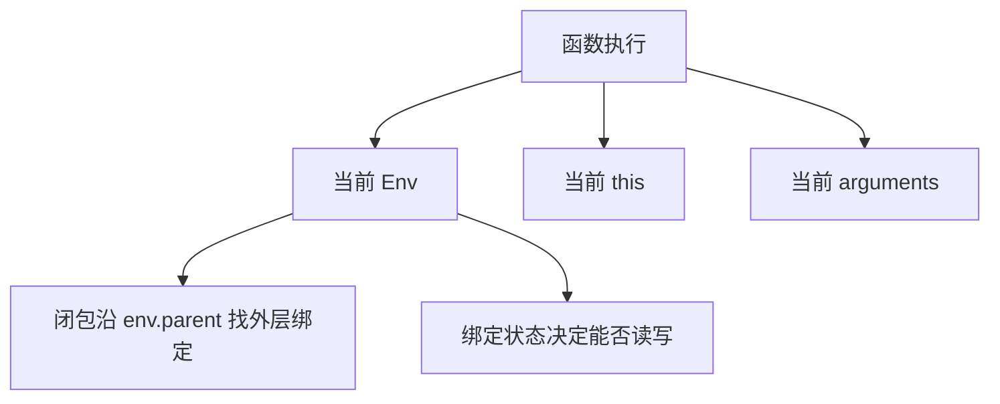

# 为什么闭包、this、arguments 与绑定状态，决定 VM 是否真正像 JavaScript？

## 本章目标

前四章已经让最小 ScriptVM 主链路跑通，但“能跑”还不等于“像 JavaScript”。这一章要解决的是最关键的运行时语义。读完以后，你应该能回答：

1. 闭包捕获的为什么是环境，而不是值？
2. `this` 为什么必须在调用时决定？
3. `arguments` 为什么更像调用上下文，而不是普通变量？
4. 为什么绑定语义必须区分“创建、初始化、赋值”三个阶段？

> 文件名沿用 `es5-core-features`，但为了把运行时模型讲完整，正文也会一起说明 `let` / `const` 与 TDZ 的落地思路。

---

## 先看地图：这几类语义，其实都在回答“当前上下文是谁”



这一章的共同主题不是“又加了几个 opcode”，而是：

> 一段代码在执行时，究竟依赖哪一组运行时上下文。

---

## 为什么闭包捕获的是环境，而不是值

先看经典例子：

```js
function makeCounter() {
  var count = 0;

  return function () {
    count = count + 1;
    return count;
  };
}
```

如果闭包捕获的是值，那么返回的内层函数应当永远只记得 `0`。真实 JavaScript 并不是这样。原因在于：

| 说法 | 是否准确 | 原因 |
|------|----------|------|
| 闭包捕获变量当前值 | 否 | 无法解释多次调用共享更新 |
| 闭包捕获外层环境引用 | 是 | 同一个绑定位置会被持续读写 |

教程里的闭包示例位于：

- `docs/examples/tutorial-jsvm/05-closure-runtime.js`

其中最关键的两段代码分别是环境链与 `MAKE_FUNCTION`。

### 环境链：决定“往哪里找外层变量”

```js
function resolveEnv(env, depth) {
  let current = env
  while (depth > 0) {
    current = current.parent
    depth -= 1
  }
  return current
}
```

### `MAKE_FUNCTION`：决定“把哪条环境链带进未来”

```js
case OPCODES.MAKE_FUNCTION: {
  const dst = code[pc++]
  const targetId = code[pc++]
  regs[dst] = function () {
    return execute(targetId, env)
  }
  break
}
```

这里真正被保存下来的，不是 `count` 的值，而是创建闭包时的 `env`。

---

## 为什么 `this` 不是定义时属性，而是调用时输入

对于普通函数，`this` 的来源不是函数写在哪里，而是“这次怎么调用”。

| 调用形式 | `this` 的来源 |
|----------|---------------|
| `obj.fn()` | `obj` |
| `fn()` | 默认绑定规则决定 |
| `new Fn()` | 新创建的实例对象 |

教程中的最小示例位于：

- `docs/examples/tutorial-jsvm/05-this-and-arguments.js`

它没有一次性实现完整调用协议，而是先把核心事实拆出来：`this` 是当前执行入口的输入参数。

```js
case OPCODES.LOAD_THIS: {
  const dst = code[pc++]
  regs[dst] = thisValue
  break
}
```

这段代码的含义很朴素，却非常关键：运行时不会从函数定义位置推导 `this`，而是从当前调用上下文拿到它。

---

## 为什么 `arguments` 更像调用上下文，而不是普通绑定

`arguments` 的语义与局部变量不同，它表示“当前这次调用收到的完整实参集合”。

教程版用独立指令把这件事直接显式化：

```js
case OPCODES.LOAD_ARGUMENTS: {
  const dst = code[pc++]
  regs[dst] = args
  break
}
```

这样设计有两个优点：

1. 运行时语义更直接，避免把它伪装成普通 slot。
2. 教学上更容易看出：`arguments` 的数据源是“调用入口”，不是“词法作用域”。

在同一份示例里，属性读取则由 `GET_PROP` 完成：

```js
case OPCODES.GET_PROP: {
  const dst = code[pc++]
  const object = regs[code[pc++]]
  const property = regs[code[pc++]]
  regs[dst] = object[property]
  break
}
```

这让 `this.label` 与 `arguments.length` 都能被统一表达为“先取上下文，再做属性访问”。

---

## 为什么绑定语义必须拆成“创建、初始化、赋值”

前面的教程示例已经在第二章通过 `INIT_SLOT` 与 `STORE_SLOT` 埋下了这个模型。现在可以把它完整说明出来。

### 绑定生命周期

| 阶段 | 含义 | 典型语义 |
|------|------|----------|
| 创建 | 绑定位置已经存在 | `var` / `let` / `const` 进入作用域时完成 |
| 初始化 | 第一次写入合法值 | `let` / `const` 在声明位置完成 |
| 赋值 | 后续写入新值 | 可变绑定才允许 |

这个分层有两个直接用途：

- 它能解释 `var` 为什么“先有名字，后有值”。
- 它能解释 `let` / `const` 为什么在初始化前不能读。

### TDZ 的本质

TDZ 并不是“没有这个变量”，而是“绑定已创建，但当前状态不可读”。

因此，更合理的运行时实现不是“找不到就报错”，而是“找到了，但状态仍未初始化”。

这也是教程第二章保留 `env.states[slot]` 的原因。教学脚手架先把状态位模型搭起来，后续就可以在正式实现中继续扩成完整的 TDZ 检查。

---

## 用两个小示例拆开讲，为什么比做一个大而全示例更有效

本章教程没有把闭包、`this`、`arguments`、TDZ 一次性塞进同一份大文件，而是拆成两份：

| 文件 | 重点 |
|------|------|
| `05-closure-runtime.js` | 只证明闭包捕获环境 |
| `05-this-and-arguments.js` | 只证明 `this` 与 `arguments` 来自调用上下文 |

这种拆法的价值在于：每个示例只验证一类运行时假设，便于你把状态变化看清楚。

---

## 本章应该带走的统一结论

表面上看，这一章讲了很多概念；从运行时角度看，它们都可以归到同一个问题：

| 语义点 | 最终落到什么运行时信息 |
|--------|------------------------|
| 闭包 | `env.parent` 链 |
| `this` | 调用入口提供的 `thisValue` |
| `arguments` | 调用入口提供的 `args` |
| 提升 | 绑定在进入作用域时已创建 |
| TDZ | 绑定存在，但状态尚未初始化 |

因此，真正决定 VM 是否“像 JavaScript”的，不是 opcode 数量，而是运行时上下文是否建模正确。

---

## 本章小结

这一章可以收成四个判断：

- 闭包捕获的是环境引用，而不是变量快照。
- `this` 与 `arguments` 都来自调用时上下文。
- `INIT_SLOT` / `STORE_SLOT` 的分离，是绑定状态模型的起点。
- 要实现接近 JavaScript 的语义，必须把“表达式求值”与“上下文建模”同时做好。

下一章我们会讨论最后一个工程问题：如何证明你的 VM 不是“碰巧跑对了”，而是能持续验证语义一致性。
