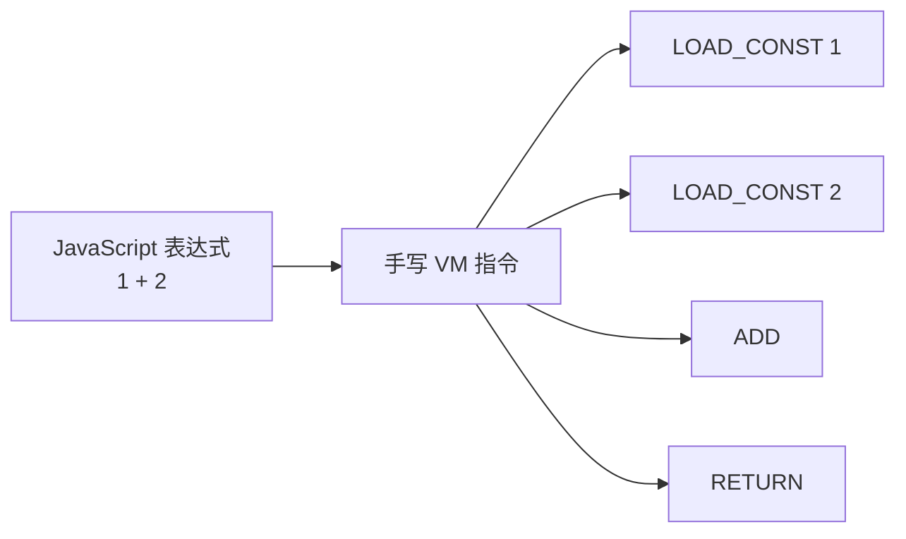
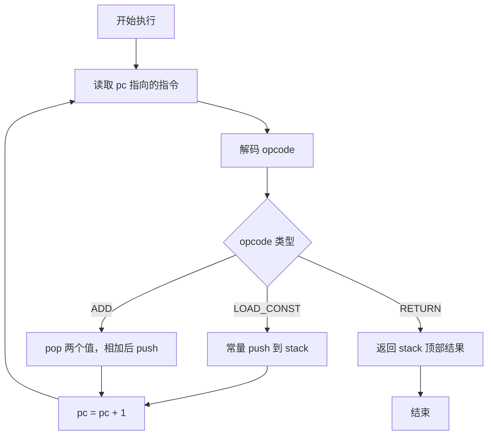
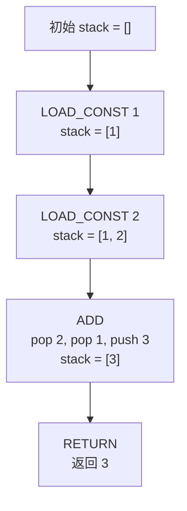

# 第 1 篇：从 `1 + 2` 开始：亲手写出第一台 JSVM

## 1. 本文目标

这一篇从一个最小目标开始：不让 JavaScript 引擎直接计算 `1 + 2`，而是让我们自己写的一台小机器来执行它。

最终我们会得到一台只支持三条指令的最小 VM：

```text
LOAD_CONST
ADD
RETURN
```

并运行下面的指令程序：

```js
const result = run([
  { op: 'LOAD_CONST', value: 1 },
  { op: 'LOAD_CONST', value: 2 },
  { op: 'ADD' },
  { op: 'RETURN' },
]);

console.log(result); // 3
```

## 2. 为什么需要一台 VM

平时我们写：

```js
1 + 2
```

JavaScript 引擎会直接帮我们算出 `3`。

但 JSVM 的思路不同。它不是把源码直接交给 JavaScript 引擎，而是先把源码翻译成一组“虚拟机器能听懂的动作”，再由我们自己写的运行时逐条执行。

### 一个形象化比喻：厨房小票

可以把源码想象成一句自然语言点餐：

```text
我要一份 1 加 2 的结果。
```

厨房机器听不懂这句话。它需要的是一张步骤明确的小票：

```text
拿出 1
拿出 2
相加
出餐
```

在 VM 里，这张小票就是指令列表：

```text
LOAD_CONST 1
LOAD_CONST 2
ADD
RETURN
```

VM 就像厨房里的自动料理机：它不理解“我要计算 1 + 2”这句话，但它能按小票一步步执行动作。

## 3. 我们先不做什么

第一篇必须足够小。暂时不做：

| 暂不实现 | 为什么先不做 |
|---|---|
| Parser | 先手写指令，避免一开始陷入语法树 |
| AST | 先理解 VM 如何跑，再让编译器生成指令 |
| 变量 | 变量需要环境和作用域 |
| 函数 | 函数需要调用帧、参数和 return |
| 闭包 | 闭包需要作用域链 |
| 对象 | 对象需要属性访问和运行时能力 |
| 数字字节码 | 先用对象形式指令，便于阅读 |

本篇只关心一件事：

```text
一组指令如何被一台 VM 执行？
```

## 4. 源码中的对应位置

正式项目 `script-vm-next` 是寄存器式 JavaScript 虚拟化原型，输出纯 JavaScript 自包含运行时代码。项目 README 明确说明它是 register-based JavaScript virtualization prototype，并包含 register-based bytecode 与 per-function register frames。

对应源码模块：

| 教学版概念 | 正式源码位置 | 说明 |
|---|---|---|
| Opcode | `src/runtime/opcodes.ts` | 定义正式 VM 支持的操作码 |
| VM 执行循环 | `src/compiler/runtime-gen.ts` | 生成运行时解释器源码 |
| `pc` | `src/compiler/runtime-gen.ts` | 运行时读取 bytecode 的当前位置 |
| 临时值存储 | `src/compiler/runtime-gen.ts` | 正式源码使用 `regs`，不是本篇的 `stack` |

本篇先用栈式 VM 入门；后续会切换到源码采用的寄存器式 VM。

## 5. 核心数据结构

### 5.1 Instruction

#### 它解决什么问题

`Instruction` 用数据描述“下一步要做什么”。

```js
{ op: 'LOAD_CONST', value: 1 }
```

意思是：把常量 `1` 放入 VM 的运行时存储区。

#### 它的数据结构

```ts
type Instruction =
  | { op: 'LOAD_CONST'; value: number }
  | { op: 'ADD' }
  | { op: 'RETURN' };
```

#### 它在源码中的对应位置

正式源码不会一直使用这种对象格式。它会先经过 IR，再由 emit 阶段压成数字 bytecode。这里的对象指令只是教学版的第一层脚手架。

#### 教学版简化实现

```js
const instructions = [
  { op: 'LOAD_CONST', value: 1 },
  { op: 'LOAD_CONST', value: 2 },
  { op: 'ADD' },
  { op: 'RETURN' },
];
```

#### 使用示例

```js
for (const instruction of instructions) {
  console.log(instruction.op);
}
```

### 5.2 Opcode

#### 它解决什么问题

`Opcode` 是指令的动作名称，告诉 VM 当前指令属于哪一种操作。

#### 它的数据结构

```js
const OPCODES = {
  LOAD_CONST: 'LOAD_CONST',
  ADD: 'ADD',
  RETURN: 'RETURN',
};
```

#### 它在源码中的对应位置

正式源码的 opcode 定义在 `src/runtime/opcodes.ts`。正式实现使用数字 opcode，而不是字符串 opcode。

#### 教学版简化实现

```js
const instruction = {
  op: OPCODES.LOAD_CONST,
  value: 1,
};
```

#### 使用示例

```js
console.log(instruction.op); // LOAD_CONST
```

### 5.3 Operand Stack

#### 它解决什么问题

`ADD` 需要知道加哪两个数。最简单的办法是使用栈：

```text
push 1
push 2
pop 2
pop 1
push 3
```

### 一个形象化比喻：盘子叠叠乐

操作数栈像一摞盘子：

```text
先放进去的盘子在下面
后放进去的盘子在上面
取的时候只能先取最上面的
```

执行 `1 + 2` 时：

```text
放入 1 号盘
放入 2 号盘
拿走 2 号盘
拿走 1 号盘
把 3 号盘放回去
```

这就是栈的后进先出。

#### 它的数据结构

```js
const stack = [];
```

#### 它在源码中的对应位置

正式源码是寄存器式 VM，因此后续会用 `regs` 替换教学版 `stack`。

#### 教学版简化实现

```js
stack.push(1);
stack.push(2);
const right = stack.pop();
const left = stack.pop();
stack.push(left + right);
```

#### 使用示例

```js
console.log(stack); // [3]
```

### 5.4 Program Counter

#### 它解决什么问题

`pc` 记录 VM 当前执行到第几条指令。

### 一个形象化比喻：读书时的手指

小朋友读书时，常常用手指指着当前读到哪一行。`pc` 就是 VM 的那根手指。

```text
pc = 0 指向第一条指令
pc = 1 指向第二条指令
pc = 2 指向第三条指令
```

#### 它的数据结构

```js
let pc = 0;
```

#### 它在源码中的对应位置

正式源码的运行时循环也使用 `pc` 从 bytecode 中读取 opcode。

#### 教学版简化实现

```js
while (pc < instructions.length) {
  const instruction = instructions[pc];
  pc++;
}
```

#### 使用示例

```js
const instructions = ['a', 'b', 'c'];
let pc = 0;

while (pc < instructions.length) {
  console.log(instructions[pc]);
  pc++;
}
```

## 6. Mermaid 图解

### 6.1 从表达式到指令



### 6.2 VM 执行循环



### 6.3 操作数栈变化



## 7. 伪代码

```text
function run(instructions):
    stack = []
    pc = 0

    while pc < instructions.length:
        instruction = instructions[pc]

        switch instruction.op:
            case LOAD_CONST:
                push instruction.value to stack

            case ADD:
                right = pop stack
                left = pop stack
                push left + right to stack

            case RETURN:
                return pop stack

        pc = pc + 1
```

## 8. 教学版实现代码

```js
const OPCODES = {
  LOAD_CONST: 'LOAD_CONST',
  ADD: 'ADD',
  RETURN: 'RETURN',
};

function run(instructions) {
  const stack = [];
  let pc = 0;

  while (pc < instructions.length) {
    const instruction = instructions[pc];

    switch (instruction.op) {
      case OPCODES.LOAD_CONST:
        stack.push(instruction.value);
        break;

      case OPCODES.ADD: {
        const right = stack.pop();
        const left = stack.pop();
        stack.push(left + right);
        break;
      }

      case OPCODES.RETURN:
        return stack.pop();

      default:
        throw new Error(`Unknown opcode: ${instruction.op}`);
    }

    pc++;
  }

  return undefined;
}

const result = run([
  { op: OPCODES.LOAD_CONST, value: 1 },
  { op: OPCODES.LOAD_CONST, value: 2 },
  { op: OPCODES.ADD },
  { op: OPCODES.RETURN },
]);

console.log(result); // 3
```

## 9. 示例输入与输出

### 示例输入

```js
1 + 2
```

### 手写指令

```js
[
  { op: 'LOAD_CONST', value: 1 },
  { op: 'LOAD_CONST', value: 2 },
  { op: 'ADD' },
  { op: 'RETURN' },
]
```

### 输出结果

```js
3
```

## 10. 执行过程拆解

| Step | PC | Instruction | Stack Before | Stack After | 说明 |
|---|---:|---|---|---|---|
| 1 | 0 | `LOAD_CONST 1` | `[]` | `[1]` | 把常量 `1` 压栈 |
| 2 | 1 | `LOAD_CONST 2` | `[1]` | `[1, 2]` | 把常量 `2` 压栈 |
| 3 | 2 | `ADD` | `[1, 2]` | `[3]` | 弹出两个值并相加 |
| 4 | 3 | `RETURN` | `[3]` | `[]` | 返回 `3` |

## 11. 与原始源码的差异

| 主题 | 教学版 | 正式源码 |
|---|---|---|
| VM 类型 | 栈式 VM | 寄存器式 VM |
| 指令格式 | 对象数组 | 数字 bytecode |
| 临时值 | `stack` | `regs` |
| 加法 | `ADD` | `BINARY + '+'` |
| 返回 | 返回栈顶 | 返回指定寄存器 |
| 作用域 | 不支持 | 支持 slot environment |

正式源码的 `runtime-gen.ts` 会生成解释器，解释器内部会创建 `regs`，读取 `metadata.bytecode`，并通过 `pc` 推进执行。

## 12. 常见问题

### Q1：这是不是太简单了？

是的，但这是 VM 的最小心脏：

```text
指令 + pc + 运行时状态 + dispatch loop
```

没有这颗心脏，后面的变量、函数、闭包都无从谈起。

### Q2：为什么不用 `eval('1 + 2')`？

因为 `eval` 还是让 JavaScript 引擎直接执行源码。JSVM 的关键是把源码变成自定义指令，再由自己的 runtime 执行。

### Q3：教学版用 stack，源码用 register，会不会冲突？

不会。本篇用 stack 是为了帮助初学者建立 VM 执行循环的直觉。下一篇开始会把对象指令压成 bytecode，再逐步过渡到寄存器式 VM。

## 13. 本文小结

我们已经亲手写出第一台最小 JSVM。它只支持三条指令，但已经具备 VM 的基本形态：

| 结构 | 本篇对应 |
|---|---|
| 指令 | `instructions` |
| opcode | `instruction.op` |
| 程序计数器 | `pc` |
| 运行时状态 | `stack` |
| 执行循环 | `while + switch` |
| 返回结果 | `RETURN` |

## 14. 下一篇预告

下一篇将继续讲：

```text
第 2 篇：设计第一套字节码：Opcode、Instruction 与 Constant Pool
```

我们会把对象形式指令：

```js
{ op: 'LOAD_CONST', value: 1 }
```

变成更接近真实 VM 的数字 bytecode：

```js
[LOAD_CONST, 0]
```
