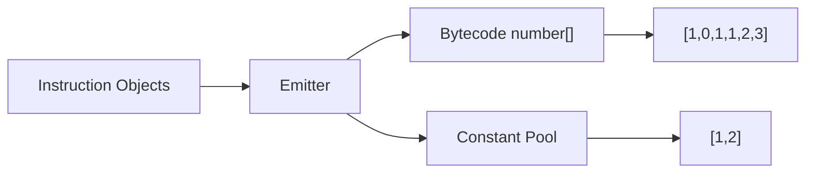
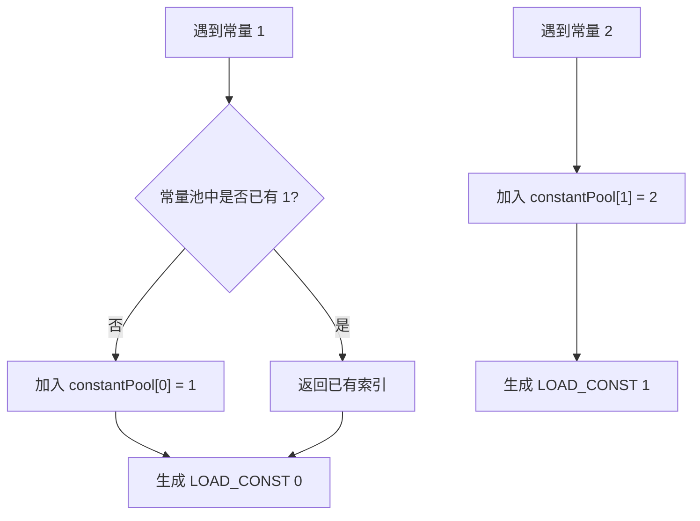
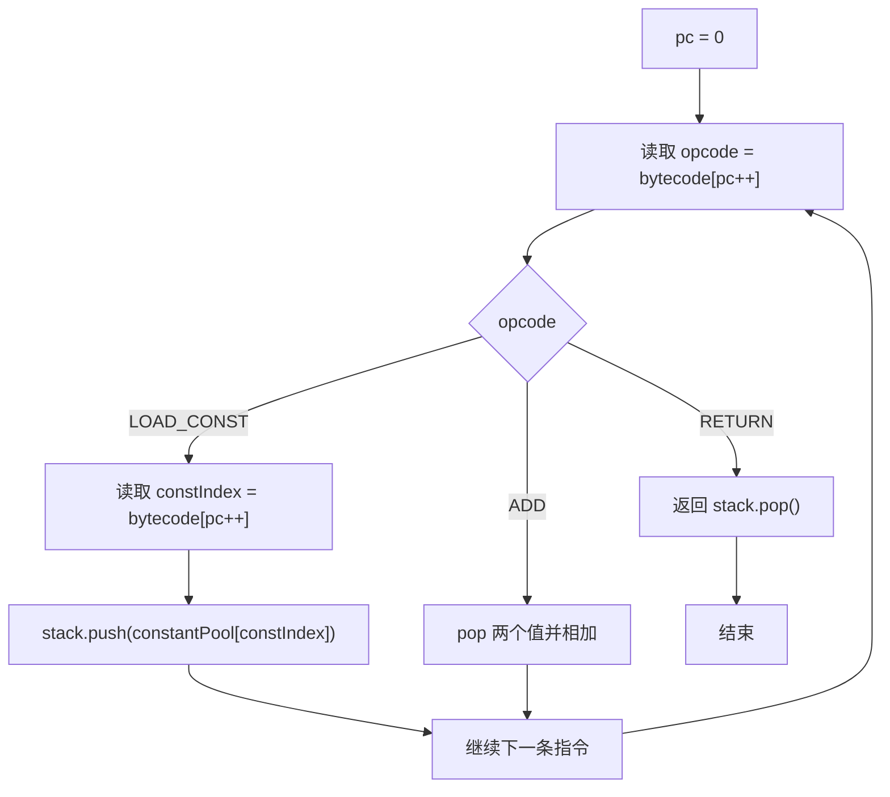

# 第 2 篇：设计第一套字节码：Opcode、Instruction 与 Constant Pool

## 1. 本文目标

上一篇我们写了一台最小 VM，它执行的是对象形式的指令：

```js
[
  { op: 'LOAD_CONST', value: 1 },
  { op: 'LOAD_CONST', value: 2 },
  { op: 'ADD' },
  { op: 'RETURN' },
]
```

本篇要把这套“适合人读”的指令，改造成更接近真实 VM 的数字 bytecode：

```js
{
  bytecode: [1, 0, 1, 1, 2, 3],
  constantPool: [1, 2]
}
```

我们会亲手实现：

1. `Opcode`
2. `Instruction`
3. `Bytecode`
4. `Constant Pool`
5. 一个能执行数字 bytecode 的最小 VM

## 2. 为什么需要字节码

对象指令很好懂，但不够像真正的机器语言。

```js
{ op: 'LOAD_CONST', value: 1 }
```

它像一张写得很清楚的便签。便签适合人类阅读，但机器更喜欢编号、索引和表格。

### 一个形象化比喻：菜单编号

在餐厅里，你可以对服务员说：

```text
我要一份番茄炒蛋，一份米饭，一杯豆浆。
```

但餐厅内部系统可能只记录：

```text
A12 B01 C07
```

其中：

```text
A12 = 番茄炒蛋
B01 = 米饭
C07 = 豆浆
```

为什么要这么做？

因为编号更短、更稳定，也更方便系统处理。

VM 也是一样。

```js
{ op: 'LOAD_CONST', value: 1 }
```

适合人读。

```js
[1, 0]
```

适合 VM 执行。

## 3. 前置知识

| 概念 | 解释 |
|---|---|
| Opcode | 指令编号，例如 `LOAD_CONST = 1` |
| Instruction | 编译阶段的人类可读指令 |
| Bytecode | VM 真正执行的数字数组 |
| Constant Pool | 保存常量的表，bytecode 只保存索引 |

## 4. 源码中的对应位置

| 概念 | 源码位置 | 说明 |
|---|---|---|
| Opcode | `src/runtime/opcodes.ts` | 定义正式 VM 支持的操作码 |
| Bytecode | `src/compiler/types.ts` | `ProgramArtifact.bytecode` 是数字数组 |
| Constant Pool | `src/compiler/emit.ts` | `ConstantPool` 类负责常量去重 |
| IR 到 Bytecode | `src/compiler/emit.ts` | `emitBytecode()` 把 IR 编成数字 bytecode |

正式源码的 `ProgramArtifact` 包含 `bytecode` 和 `constantPool`，这两个字段就是 runtime 执行程序时最核心的数据。

## 5. 核心数据结构

### 5.1 Opcode

#### 它解决什么问题

`Opcode` 用一个稳定编号表示一种 VM 操作。

#### 它的数据结构

```js
const OPCODES = {
  LOAD_CONST: 1,
  ADD: 2,
  RETURN: 3,
};
```

#### 它在源码中的对应位置

正式源码的 `OPCODES` 定义在 `src/runtime/opcodes.ts`。正式实现有更多 opcode，例如 `LOAD_CONST`、`BINARY`、`RETURN`、`CALL`、`MAKE_FUNCTION`。

#### 教学版简化实现

```js
console.log(OPCODES.LOAD_CONST); // 1
```

#### 使用示例

```js
const bytecode = [OPCODES.LOAD_CONST, 0];
```

### 5.2 Instruction

#### 它解决什么问题

`Instruction` 是 bytecode 之前的可读形态，方便编译器生成和调试。

#### 它的数据结构

```ts
type Instruction =
  | { op: 'LOAD_CONST'; value: unknown }
  | { op: 'ADD' }
  | { op: 'RETURN' };
```

#### 它在源码中的对应位置

正式源码中会先形成 IR 指令，再由 `emitBytecode()` 编成数字 bytecode。

#### 教学版简化实现

```js
const instructions = [
  { op: 'LOAD_CONST', value: 1 },
  { op: 'LOAD_CONST', value: 2 },
  { op: 'ADD' },
  { op: 'RETURN' },
];
```

#### 使用示例

```js
for (const instruction of instructions) {
  console.log(instruction.op);
}
```

### 5.3 Bytecode

#### 它解决什么问题

`Bytecode` 用紧凑的数字数组表示程序。

#### 它的数据结构

```ts
type Bytecode = number[];
```

#### 它在源码中的对应位置

正式源码中的 `ProgramArtifact.bytecode` 类型就是 `number[]`。

#### 教学版简化实现

```js
const bytecode = [
  OPCODES.LOAD_CONST, 0,
  OPCODES.LOAD_CONST, 1,
  OPCODES.ADD,
  OPCODES.RETURN,
];
```

#### 使用示例

```js
let pc = 0;
const opcode = bytecode[pc++];
console.log(opcode); // 1
```

### 5.4 Constant Pool

#### 它解决什么问题

`Constant Pool` 把常量统一放到一张表里，bytecode 只保存索引。

### 一个形象化比喻：仓库货架

可以把常量池想象成仓库货架：

```text
0 号货架：1
1 号货架：2
2 号货架："hello"
```

bytecode 不直接搬货物，只写货架编号：

```text
LOAD_CONST 0
```

意思是：

```text
去 0 号货架取货。
```

#### 它的数据结构

```js
class ConstantPool {
  constructor() {
    this.values = [];
    this.map = new Map();
  }

  add(value) {
    const key = JSON.stringify(value);

    if (this.map.has(key)) {
      return this.map.get(key);
    }

    const index = this.values.length;
    this.values.push(value);
    this.map.set(key, index);
    return index;
  }
}
```

#### 它在源码中的对应位置

正式源码的 `src/compiler/emit.ts` 中也有 `ConstantPool` 类，维护 `values` 和 `map`，用 `add(value)` 返回常量索引。

#### 教学版简化实现

```js
const pool = new ConstantPool();

console.log(pool.add(1)); // 0
console.log(pool.add(2)); // 1
console.log(pool.add(1)); // 0
console.log(pool.values); // [1, 2]
```

#### 使用示例

```js
const constantPool = [1, 2];
const value = constantPool[0];
console.log(value); // 1
```

## 6. Mermaid 图解

### 6.1 从对象指令到 bytecode



### 6.2 Constant Pool 工作方式



### 6.3 Bytecode 执行循环



## 7. 伪代码

### 7.1 emit：对象指令转 bytecode

```text
function emit(instructions):
    constantPool = []
    bytecode = []

    for each instruction in instructions:
        switch instruction.op:
            case LOAD_CONST:
                index = add instruction.value to constantPool
                push OPCODES.LOAD_CONST to bytecode
                push index to bytecode

            case ADD:
                push OPCODES.ADD to bytecode

            case RETURN:
                push OPCODES.RETURN to bytecode

    return { bytecode, constantPool }
```

### 7.2 run：执行数字 bytecode

```text
function run(bytecode, constantPool):
    stack = []
    pc = 0

    while pc < bytecode.length:
        opcode = bytecode[pc]
        pc = pc + 1

        switch opcode:
            case LOAD_CONST:
                constIndex = bytecode[pc]
                pc = pc + 1
                push constantPool[constIndex] to stack

            case ADD:
                right = pop stack
                left = pop stack
                push left + right to stack

            case RETURN:
                return pop stack
```

## 8. 教学版实现代码

```js
const OPCODES = {
  LOAD_CONST: 1,
  ADD: 2,
  RETURN: 3,
};

class ConstantPool {
  constructor() {
    this.values = [];
    this.map = new Map();
  }

  add(value) {
    const key = JSON.stringify(value);

    if (this.map.has(key)) {
      return this.map.get(key);
    }

    const index = this.values.length;
    this.values.push(value);
    this.map.set(key, index);
    return index;
  }
}

function emit(instructions) {
  const pool = new ConstantPool();
  const bytecode = [];

  for (const instruction of instructions) {
    switch (instruction.op) {
      case 'LOAD_CONST': {
        const index = pool.add(instruction.value);
        bytecode.push(OPCODES.LOAD_CONST, index);
        break;
      }

      case 'ADD':
        bytecode.push(OPCODES.ADD);
        break;

      case 'RETURN':
        bytecode.push(OPCODES.RETURN);
        break;

      default:
        throw new Error(`Unknown instruction: ${instruction.op}`);
    }
  }

  return {
    bytecode,
    constantPool: pool.values,
  };
}

function run(bytecode, constantPool) {
  const stack = [];
  let pc = 0;

  while (pc < bytecode.length) {
    const opcode = bytecode[pc++];

    switch (opcode) {
      case OPCODES.LOAD_CONST: {
        const constIndex = bytecode[pc++];
        stack.push(constantPool[constIndex]);
        break;
      }

      case OPCODES.ADD: {
        const right = stack.pop();
        const left = stack.pop();
        stack.push(left + right);
        break;
      }

      case OPCODES.RETURN:
        return stack.pop();

      default:
        throw new Error(`Unknown opcode: ${opcode}`);
    }
  }
}

const instructions = [
  { op: 'LOAD_CONST', value: 1 },
  { op: 'LOAD_CONST', value: 2 },
  { op: 'ADD' },
  { op: 'RETURN' },
];

const artifact = emit(instructions);

console.log(artifact);
// { bytecode: [1, 0, 1, 1, 2, 3], constantPool: [1, 2] }

console.log(run(artifact.bytecode, artifact.constantPool)); // 3
```

## 9. 示例输入与输出

### 示例输入

```js
[
  { op: 'LOAD_CONST', value: 1 },
  { op: 'LOAD_CONST', value: 2 },
  { op: 'ADD' },
  { op: 'RETURN' },
]
```

### 编译后 bytecode

```js
[1, 0, 1, 1, 2, 3]
```

### Constant Pool

```js
[1, 2]
```

### 输出结果

```js
3
```

## 10. 执行过程拆解

### 编译过程

| Step | Instruction | Constant Pool Before | Bytecode Before | Constant Pool After | Bytecode After |
|---|---|---|---|---|---|
| 1 | `LOAD_CONST 1` | `[]` | `[]` | `[1]` | `[1, 0]` |
| 2 | `LOAD_CONST 2` | `[1]` | `[1, 0]` | `[1, 2]` | `[1, 0, 1, 1]` |
| 3 | `ADD` | `[1, 2]` | `[1, 0, 1, 1]` | `[1, 2]` | `[1, 0, 1, 1, 2]` |
| 4 | `RETURN` | `[1, 2]` | `[1, 0, 1, 1, 2]` | `[1, 2]` | `[1, 0, 1, 1, 2, 3]` |

### 执行过程

| Step | PC Before | Opcode | Extra Operand | Stack Before | Stack After | PC After |
|---|---:|---|---|---|---|---:|
| 1 | 0 | `LOAD_CONST` | `0` | `[]` | `[1]` | 2 |
| 2 | 2 | `LOAD_CONST` | `1` | `[1]` | `[1, 2]` | 4 |
| 3 | 4 | `ADD` | 无 | `[1, 2]` | `[3]` | 5 |
| 4 | 5 | `RETURN` | 无 | `[3]` | `[]` | 6 |

## 11. 与原始源码的差异

| 主题 | 教学版 | 正式源码 |
|---|---|---|
| opcode | `LOAD_CONST = 1` | `LOAD_CONST = 4` |
| 加法 | `ADD` | `BINARY + BINARY_OPS['+']` |
| 常量池 | 简化版 `ConstantPool` | `src/compiler/emit.ts` 中的 `ConstantPool` |
| bytecode | 栈式 bytecode | 寄存器式 bytecode |
| `LOAD_CONST` 参数 | `constIndex` | `dstRegister, constIndex` |
| `RETURN` 参数 | 无，返回栈顶 | `srcRegister` |

正式源码中的 `emitBytecode()` 会遍历函数 IR，把每条 IR 编成数字，并写入统一的 `bytecode` 数组。

## 12. 常见问题

### Q1：为什么不直接执行对象指令？

可以直接执行，但对象指令更像“调试格式”，bytecode 更像“机器格式”。真实 VM 通常会选择更紧凑、更稳定的 bytecode。

### Q2：Constant Pool 只是为了省空间吗？

不只是。它还让 bytecode 保持纯数字化，让字符串、数字、属性名等常量统一管理。

### Q3：`JSON.stringify` 做常量去重有没有边界问题？

有。比如 `undefined`、函数、Symbol、循环引用都不适合用 JSON 序列化。教学版先接受这个简化，正式工程如果要支持更复杂常量，需要更严格的 key 生成策略。

## 13. 本文小结

这一篇我们完成了从对象指令到数字 bytecode 的第一步：

```text
Instruction[]
  -> emit()
  -> { bytecode, constantPool }
  -> run(bytecode, constantPool)
  -> result
```

我们新增了四个核心结构：

| 概念 | 作用 |
|---|---|
| Opcode | 用数字表示指令类型 |
| Instruction | 编译阶段的人类可读指令 |
| Bytecode | VM 执行的数字数组 |
| Constant Pool | 保存常量并返回索引 |

## 14. 下一篇预告

下一篇将继续讲：

```text
第 3 篇：从栈式 VM 到寄存器式 VM：为什么 script-vm-next 选择寄存器
```

我们会把：

```text
LOAD_CONST 0
LOAD_CONST 1
ADD
RETURN
```

改造成：

```text
LOAD_CONST r0, const[0]
LOAD_CONST r1, const[1]
BINARY r2, r0, r1, '+'
RETURN r2
```
