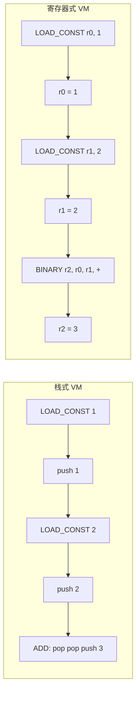
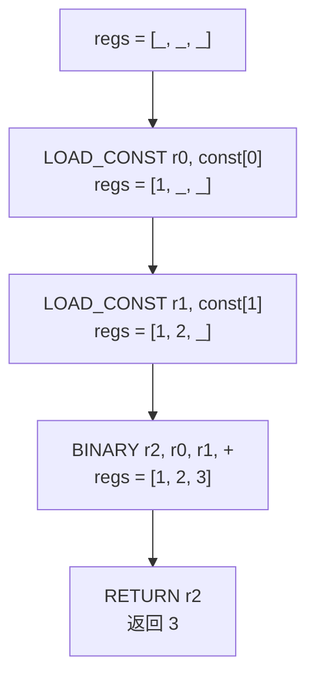

# 第 3 篇：从栈式 VM 到寄存器式 VM：为什么 script-vm-next 选择寄存器

## 1. 本文目标

前两篇我们已经让 VM 能执行：

```js
1 + 2
```

不过它还是栈式 VM：临时值都放在 `stack` 里。本篇要把它升级成寄存器式 VM：

```text
LOAD_CONST r0, const[0]
LOAD_CONST r1, const[1]
BINARY r2, r0, r1, '+'
RETURN r2
```

这一步很重要，因为正式项目 `script-vm-next` 是 register-based JavaScript virtualization prototype，并且使用 register-based bytecode 与 per-function register frames。

## 2. 为什么需要寄存器式 VM

栈式 VM 很适合入门：

```text
LOAD_CONST 1
LOAD_CONST 2
ADD
RETURN
```

但栈式 VM 的数据流是隐式的。`ADD` 默认从栈顶取两个值，读者必须一直记住“当前栈顶是什么”。

寄存器式 VM 会把数据流写清楚：

```text
r0 = 1
r1 = 2
r2 = r0 + r1
return r2
```

## 3. 形象化比喻：从叠盘子到编号工作台

### 栈式 VM：盘子叠叠乐

栈像一摞盘子：后放上去的盘子先被拿走。执行 `ADD` 时，VM 从最上面拿两个盘子，相加后再放回一个新盘子。

### 寄存器式 VM：编号工作台

寄存器像一排编号工作台：

```text
r0 工作台
r1 工作台
r2 工作台
```

执行加法时，VM 不再说“拿栈顶两个值”，而是说：

```text
从 r0 和 r1 取材料，把结果放到 r2。
```

这让数据流更直观，也更接近 `script-vm-next` 的真实设计。

## 4. 前置知识

| 概念 | 说明 |
|---|---|
| Stack VM | 临时值放在操作数栈中 |
| Register VM | 临时值放在寄存器数组中 |
| Register | 一个编号位置，例如 `r0` |
| Register Frame | 一个函数执行时拥有的一组寄存器 |
| Bytecode Operand | opcode 后面的参数，例如目标寄存器、源寄存器、常量索引 |
| Program Counter | 当前读取 bytecode 的位置 |

## 5. 源码中的对应位置

| 概念 | 源码位置 | 说明 |
|---|---|---|
| Register-based 定位 | `README.md` | 项目采用寄存器式 bytecode |
| Opcode | `src/runtime/opcodes.ts` | `LOAD_CONST`、`BINARY`、`RETURN` 等指令定义 |
| Binary Operator | `src/runtime/opcodes.ts` | `BINARY_OPS['+']` 表示加法 |
| Register Frame | `src/compiler/runtime-gen.ts` | `regs = new Array(meta.registerCount)` |
| Emit | `src/compiler/emit.ts` | 把 IR 编成带寄存器参数的 bytecode |

## 6. 核心数据结构

### Register

#### 它解决什么问题

`Register` 用来保存表达式计算中的临时值。

#### 它的数据结构

```js
const regs = new Array(3);
```

#### 它在源码中的对应位置

正式运行时会根据函数元信息创建 `regs`。

#### 教学版简化实现

```js
regs[0] = 1;
regs[1] = 2;
regs[2] = regs[0] + regs[1];
```

#### 使用示例

```js
console.log(regs[2]); // 3
```

### Register Frame

#### 它解决什么问题

每个函数执行时都应该拥有自己的寄存器空间，避免不同函数互相污染。

#### 它的数据结构

```js
function createFrame(registerCount) {
  return {
    regs: new Array(registerCount),
  };
}
```

#### 它在源码中的对应位置

正式源码通过 `FunctionMeta.registerCount` 决定当前函数需要多少寄存器。

#### 教学版简化实现

```js
const frame = createFrame(3);
```

#### 使用示例

```js
frame.regs[0] = 1;
```

### Register Bytecode

#### 它解决什么问题

寄存器式 bytecode 把目标位置和源位置都写在指令里。

#### 它的数据结构

```js
[
  OPCODES.LOAD_CONST, 0, 0,
  OPCODES.LOAD_CONST, 1, 1,
  OPCODES.BINARY, 2, 0, 1, BINARY_OPS['+'],
  OPCODES.RETURN, 2,
]
```

#### 它在源码中的对应位置

正式源码中的 `load_const` 会被编码为 `LOAD_CONST, dst, constantIndex`，`binary` 会被编码为 `BINARY, dst, left, right, operator`。

#### 教学版简化实现

```js
const bytecode = [1, 0, 0, 1, 1, 1, 2, 2, 0, 1, 1, 3, 2];
```

#### 使用示例

```js
const opcode = bytecode[0];
```

## 7. Mermaid 图解

### 栈式 VM 与寄存器式 VM 对比



### `1 + 2` 的寄存器变化



## 8. 伪代码

```text
function run(bytecode, constantPool, registerCount):
    regs = new Array(registerCount)
    pc = 0

    while pc < bytecode.length:
        opcode = bytecode[pc]
        pc = pc + 1

        switch opcode:
            case LOAD_CONST:
                dst = bytecode[pc]
                constIndex = bytecode[pc + 1]
                pc = pc + 2
                regs[dst] = constantPool[constIndex]

            case BINARY:
                dst = bytecode[pc]
                left = bytecode[pc + 1]
                right = bytecode[pc + 2]
                operator = bytecode[pc + 3]
                pc = pc + 4
                regs[dst] = binary(operator, regs[left], regs[right])

            case RETURN:
                src = bytecode[pc]
                return regs[src]
```

## 9. 教学版实现代码

```js
const OPCODES = {
  LOAD_CONST: 1,
  BINARY: 2,
  RETURN: 3,
};

const BINARY_OPS = {
  '+': 1,
  '-': 2,
  '*': 3,
  '/': 4,
};

function binary(operator, left, right) {
  switch (operator) {
    case BINARY_OPS['+']:
      return left + right;
    case BINARY_OPS['-']:
      return left - right;
    case BINARY_OPS['*']:
      return left * right;
    case BINARY_OPS['/']:
      return left / right;
    default:
      throw new Error(`Unknown binary operator: ${operator}`);
  }
}

function run(bytecode, constantPool, registerCount) {
  const regs = new Array(registerCount);
  let pc = 0;

  while (pc < bytecode.length) {
    const opcode = bytecode[pc++];

    switch (opcode) {
      case OPCODES.LOAD_CONST: {
        const dst = bytecode[pc++];
        const constIndex = bytecode[pc++];
        regs[dst] = constantPool[constIndex];
        break;
      }

      case OPCODES.BINARY: {
        const dst = bytecode[pc++];
        const left = bytecode[pc++];
        const right = bytecode[pc++];
        const operator = bytecode[pc++];
        regs[dst] = binary(operator, regs[left], regs[right]);
        break;
      }

      case OPCODES.RETURN: {
        const src = bytecode[pc++];
        return regs[src];
      }

      default:
        throw new Error(`Unknown opcode: ${opcode}`);
    }
  }
}

const constantPool = [1, 2];
const bytecode = [
  OPCODES.LOAD_CONST, 0, 0,
  OPCODES.LOAD_CONST, 1, 1,
  OPCODES.BINARY, 2, 0, 1, BINARY_OPS['+'],
  OPCODES.RETURN, 2,
];

console.log(run(bytecode, constantPool, 3)); // 3
```

## 10. 示例输入与输出

### 示例输入

```js
1 + 2
```

### Register Bytecode

```text
LOAD_CONST r0, const[0]
LOAD_CONST r1, const[1]
BINARY r2, r0, r1, '+'
RETURN r2
```

### 输出结果

```js
3
```

## 11. 执行过程拆解

| Step | PC | Instruction | Registers Before | Registers After |
|---|---:|---|---|---|
| 1 | 0 | `LOAD_CONST r0, const[0]` | `[_, _, _]` | `[1, _, _]` |
| 2 | 3 | `LOAD_CONST r1, const[1]` | `[1, _, _]` | `[1, 2, _]` |
| 3 | 6 | `BINARY r2, r0, r1, '+'` | `[1, 2, _]` | `[1, 2, 3]` |
| 4 | 11 | `RETURN r2` | `[1, 2, 3]` | `[1, 2, 3]` |

## 12. 与原始源码的差异

| 主题 | 教学版 | 正式源码 |
|---|---|---|
| opcode 编码 | 从 1 开始简化 | 使用 `src/runtime/opcodes.ts` 中的正式编号 |
| 二元运算 | `BINARY` 支持四则运算 | `BINARY_OPS` 支持更多 JS 运算符 |
| 寄存器数量 | 手动传入 | 来自函数元信息 `registerCount` |
| bytecode 范围 | 整个数组 | 每个函数有 `entry` 和 `end` |
| 环境 | 不支持变量 | 后续通过 slot/env 支持变量 |

## 13. 常见问题

### Q1：寄存器是 CPU 的真实寄存器吗？

不是。这里的寄存器只是 VM 自己模拟出来的数组位置。

### Q2：寄存器式 VM 一定比栈式 VM 快吗？

不一定。本文重点不是证明性能，而是说明寄存器式 VM 的数据流更显式，更适合后续编译和调试。

### Q3：为什么正式源码不用 `ADD`？

因为 `ADD` 只是二元运算的一种。正式源码用 `BINARY + operatorCode` 统一表示多种二元操作。

## 14. 本文小结

这一篇我们完成了关键升级：

```text
栈式 VM -> 寄存器式 VM
```

现在临时值不再只依赖隐式栈顶，而是有明确的寄存器位置。

下一篇将继续讲：

```text
第 4 篇：让 VM 支持变量：Slot、Environment 与 TDZ
```
