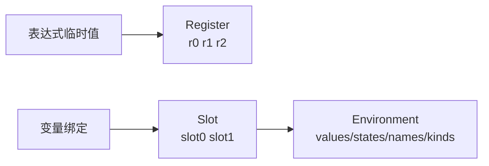
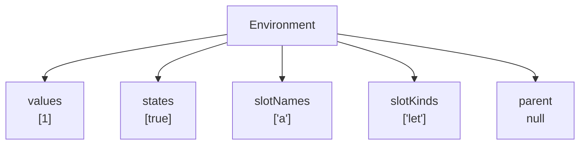
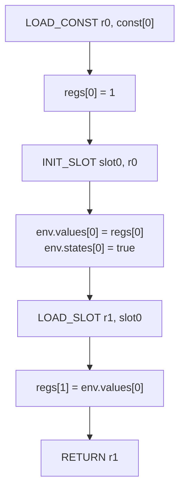
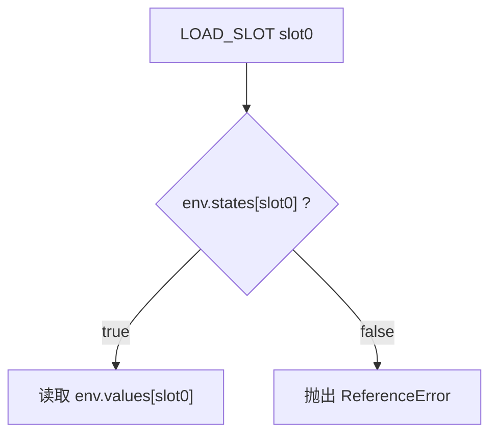

# 第 4 篇：让 VM 支持变量：Slot、Environment 与 TDZ

## 1. 本文目标

前三篇我们已经让 VM 能执行表达式：

```js
1 + 2
```

到第 3 篇为止，我们拥有的是一台寄存器式表达式计算机。它能把临时值放进 `r0`、`r1`、`r2`：

```text
LOAD_CONST r0, const[0]
LOAD_CONST r1, const[1]
BINARY r2, r0, r1, '+'
RETURN r2
```

但 JavaScript 不只有表达式。真正的代码会写变量：

```js
let a = 1;
a;
```

本篇要解决的问题是：

> VM 如何保存变量、读取变量，并区分“临时值”和“变量绑定”？

我们会从 0 实现：

1. `Slot`
2. `Environment`
3. `LOAD_SLOT`
4. `INIT_SLOT`
5. `STORE_SLOT`
6. 一个最小 TDZ 检查

最终支持：

```js
let a = 1;
a;
```

输出：

```js
1
```

## 2. 为什么寄存器还不够

上一篇我们有了寄存器：

```js
regs[0] = 1;
regs[1] = 2;
regs[2] = regs[0] + regs[1];
```

寄存器适合保存表达式计算中的临时值。

但变量不是临时值。

例如：

```js
let a = 1;
let b = a + 2;
a;
```

这里的 `a` 需要在多条语句之间长期存在。

如果只用寄存器，会遇到几个问题：

| 问题 | 说明 |
|---|---|
| 变量名丢失 | `a` 到底对应哪个寄存器？ |
| 生命周期不同 | 表达式临时值很快就没用，变量可能要存很久 |
| 作用域不同 | 不同 block / function 里可以有同名变量 |
| TDZ | `let` / `const` 在初始化前不能读取 |

所以我们需要把“临时计算位置”和“变量绑定位置”分开。

```text
Register：表达式计算的临时工作台
Slot：变量绑定的固定储物格
Environment：一组 slot 组成的作用域盒子
```

## 3. 形象化比喻：工作台、储物柜与房间

### 3.1 Register 像临时工作台

寄存器像厨师面前的临时工作台：

```text
r0 放刚切好的葱
r1 放刚打好的蛋
r2 放刚炒出来的结果
```

这些东西服务于“当前这道菜”。菜做完后，工作台可以清空，也可以被下一道菜复用。

### 3.2 Slot 像贴了名字的储物柜

变量更像储物柜：

```text
slot0: a
slot1: b
slot2: count
```

只要变量还在作用域里，储物柜就存在。

`let a = 1` 的意思不是“把 1 放到某个临时工作台”，而是：

```text
找到 a 对应的储物柜，把 1 放进去。
```

### 3.3 Environment 像一整个房间

一个作用域可以包含很多变量。这个作用域就像一个房间，里面有一排储物柜：

```text
Global Environment
  slot0: a
  slot1: b
  slot2: add
```

函数作用域、块级作用域也都有自己的房间。

后续讲闭包时，我们会把多个房间串成链，也就是 scope chain。

## 4. 前置知识

| 概念 | 说明 |
|---|---|
| Register | 表达式临时值位置，例如 `r0` |
| Slot | 变量绑定位置，例如 `slot0` |
| Environment | 一组 slot 的运行时容器 |
| TDZ | Temporal Dead Zone，`let` / `const` 初始化前不能读取 |
| Binding | 变量名到 slot 的映射 |
| Scope | 变量可见范围 |

## 5. 源码中的对应位置

正式源码中已经有完整的变量与环境模型：

| 概念 | 源码位置 | 说明 |
|---|---|---|
| `BindingRef` | `src/compiler/ir.ts` | 变量可以解析成 slot 或 global |
| `SlotKind` | `src/compiler/ir.ts` | 区分 `var`、`let`、`const`、`param` 等 |
| `load_slot` / `init_slot` / `store_slot` | `src/compiler/ir.ts` | IR 层的变量读写指令 |
| `ScopeFrame` | `src/compiler/lowering.ts` | 编译期作用域帧 |
| `declareBinding()` | `src/compiler/lowering.ts` | 给变量分配 slot |
| `resolve()` | `src/compiler/lowering.ts` | 把变量名解析成 slot depth |
| `createEnv()` | `src/compiler/runtime-gen.ts` | 创建运行时环境 |
| `readSlot()` / `writeSlot()` | `src/compiler/runtime-gen.ts` | 运行时读写变量 slot |

源码中的 `BindingRef` 表示变量解析结果：要么是 `{ kind: 'slot', depth, slot }`，要么是全局变量 `{ kind: 'global', name }`；`SlotKind` 则区分 `var`、`let`、`const`、`param`、`function`、`catch` 等绑定类型。

## 6. 核心数据结构

### 6.1 Slot

#### 它解决什么问题

`Slot` 解决变量“放在哪里”的问题。

源码：

```js
let a = 1;
```

编译期可以把变量名 `a` 分配到 `slot0`：

```text
a -> slot0
```

运行时只需要读写 `slot0`。

#### 它的数据结构

教学版：

```js
const bindings = new Map([
  ['a', 0],
]);
```

也可以记录变量种类：

```js
const slotKinds = ['let'];
const slotNames = ['a'];
```

#### 它在源码中的对应位置

正式源码的 `FunctionIR` 中保存了 `slotNames` 和 `slotKinds`。IR 指令中也定义了 `load_slot`、`init_slot`、`store_slot`。

#### 教学版简化实现

```js
const slot = 0;
env.values[slot] = 1;
```

#### 使用示例

```js
console.log(env.values[0]); // a 的值
```

### 6.2 Environment

#### 它解决什么问题

`Environment` 解决“这一批变量由谁保存”的问题。

一个环境至少需要：

1. `values`：slot 对应的值；
2. `states`：slot 是否已经初始化；
3. `slotNames`：调试和报错用；
4. `slotKinds`：区分 `let`、`const` 等；
5. `parent`：指向外层环境。

#### 它的数据结构

教学版：

```js
function createEnv(slotNames, slotKinds, parent = null) {
  return {
    values: new Array(slotNames.length),
    states: new Array(slotNames.length).fill(false),
    slotNames,
    slotKinds,
    parent,
  };
}
```

#### 它在源码中的对应位置

正式源码的 `createEnv()` 会创建包含 `values`、`states`、`slotKinds`、`slotNames`、`parent`、`thisValue`、`args` 的环境对象。

#### 教学版简化实现

```js
const env = createEnv(['a'], ['let']);
```

#### 使用示例

```js
env.values[0] = 1;
env.states[0] = true;
```

### 6.3 TDZ State

#### 它解决什么问题

JavaScript 中：

```js
console.log(a);
let a = 1;
```

会报错。

原因是 `a` 已经进入作用域，但还没有初始化。这段区域叫 TDZ：Temporal Dead Zone。

#### 它的数据结构

教学版用布尔值表示：

```js
states[slot] = false; // 未初始化
states[slot] = true;  // 已初始化
```

#### 它在源码中的对应位置

正式源码里，`assertInitialized()` 会检查 `targetEnv.states[slot]`。如果 slot 还没有初始化，就抛出 `ReferenceError`。

#### 教学版简化实现

```js
function assertInitialized(env, slot) {
  if (!env.states[slot]) {
    throw new ReferenceError(`Cannot access '${env.slotNames[slot]}' before initialization`);
  }
}
```

#### 使用示例

```js
assertInitialized(env, 0);
```

### 6.4 Runtime Context

#### 它解决什么问题

当 VM 执行时，需要同时保存：

- bytecode；
- constant pool；
- registers；
- environment；
- pc。

这些合起来就是一个最小运行时上下文。

#### 它的数据结构

教学版：

```js
const ctx = {
  bytecode,
  constantPool,
  regs: new Array(2),
  env,
  pc: 0,
};
```

#### 它在源码中的对应位置

正式源码中这些状态分散在 `executeSync()` 的局部变量中：`meta`、`env`、`regs`、`code`、`pc`。

#### 教学版简化实现

```js
function createRuntimeContext(bytecode, constantPool, env) {
  return {
    bytecode,
    constantPool,
    regs: new Array(4),
    env,
    pc: 0,
  };
}
```

#### 使用示例

```js
ctx.regs[0] = ctx.constantPool[0];
```

## 7. Mermaid 图解

### 7.1 Register 与 Slot 的分工



### 7.2 Environment 结构图



### 7.3 `let a = 1; a;` 执行流程



### 7.4 TDZ 检查流程



## 8. 伪代码

### 8.1 创建环境

```text
function createEnv(slotNames, slotKinds):
    env.values = array with slotNames.length
    env.states = array filled with false
    env.slotNames = slotNames
    env.slotKinds = slotKinds
    env.parent = null
    return env
```

### 8.2 初始化变量

```text
case INIT_SLOT:
    slot = read bytecode
    src = read bytecode
    env.values[slot] = regs[src]
    env.states[slot] = true
```

### 8.3 读取变量

```text
case LOAD_SLOT:
    dst = read bytecode
    slot = read bytecode

    if env.states[slot] is false:
        throw ReferenceError

    regs[dst] = env.values[slot]
```

### 8.4 写入变量

```text
case STORE_SLOT:
    slot = read bytecode
    src = read bytecode

    if env.states[slot] is false:
        throw ReferenceError

    if env.slotKinds[slot] is const:
        throw TypeError

    env.values[slot] = regs[src]
```

## 9. 教学版实现代码

### 9.1 定义 opcode

```js
const OPCODES = {
  LOAD_CONST: 1,
  LOAD_SLOT: 2,
  INIT_SLOT: 3,
  STORE_SLOT: 4,
  RETURN: 5,
};
```

### 9.2 创建环境

```js
function createEnv(slotNames, slotKinds, parent = null) {
  return {
    values: new Array(slotNames.length),
    states: new Array(slotNames.length).fill(false),
    slotNames,
    slotKinds,
    parent,
  };
}
```

### 9.3 读写 slot

```js
function assertInitialized(env, slot) {
  if (!env.states[slot]) {
    throw new ReferenceError(
      `Cannot access '${env.slotNames[slot]}' before initialization`
    );
  }
}

function readSlot(env, slot) {
  assertInitialized(env, slot);
  return env.values[slot];
}

function writeSlot(env, slot, value, isInit) {
  const kind = env.slotKinds[slot];

  if (isInit) {
    env.values[slot] = value;
    env.states[slot] = true;
    return value;
  }

  assertInitialized(env, slot);

  if (kind === 'const') {
    throw new TypeError(`Assignment to constant variable '${env.slotNames[slot]}'`);
  }

  env.values[slot] = value;
  return value;
}
```

### 9.4 VM 主循环

```js
function run(bytecode, constantPool, env, registerCount) {
  const regs = new Array(registerCount);
  let pc = 0;

  while (pc < bytecode.length) {
    const opcode = bytecode[pc++];

    switch (opcode) {
      case OPCODES.LOAD_CONST: {
        const dst = bytecode[pc++];
        const constIndex = bytecode[pc++];
        regs[dst] = constantPool[constIndex];
        break;
      }

      case OPCODES.INIT_SLOT: {
        const slot = bytecode[pc++];
        const src = bytecode[pc++];
        writeSlot(env, slot, regs[src], true);
        break;
      }

      case OPCODES.LOAD_SLOT: {
        const dst = bytecode[pc++];
        const slot = bytecode[pc++];
        regs[dst] = readSlot(env, slot);
        break;
      }

      case OPCODES.STORE_SLOT: {
        const slot = bytecode[pc++];
        const src = bytecode[pc++];
        writeSlot(env, slot, regs[src], false);
        break;
      }

      case OPCODES.RETURN: {
        const src = bytecode[pc++];
        return regs[src];
      }

      default:
        throw new Error(`Unknown opcode: ${opcode}`);
    }
  }
}
```

### 9.5 执行 `let a = 1; a;`

```js
const env = createEnv(['a'], ['let']);
const constantPool = [1];

const bytecode = [
  // r0 = const[0]
  OPCODES.LOAD_CONST, 0, 0,

  // slot0(a) = r0; initialized = true
  OPCODES.INIT_SLOT, 0, 0,

  // r1 = slot0(a)
  OPCODES.LOAD_SLOT, 1, 0,

  // return r1
  OPCODES.RETURN, 1,
];

console.log(run(bytecode, constantPool, env, 2)); // 1
```

## 10. 示例输入与输出

### 10.1 示例输入

```js
let a = 1;
a;
```

### 10.2 教学版变量分配

```text
a -> slot0
```

### 10.3 Constant Pool

```js
[1]
```

### 10.4 Bytecode

```text
LOAD_CONST r0, const[0]
INIT_SLOT slot0, r0
LOAD_SLOT r1, slot0
RETURN r1
```

### 10.5 输出结果

```js
1
```

## 11. 执行过程拆解

| Step | PC | Instruction | Registers Before | Environment Before | Registers After | Environment After |
|---|---:|---|---|---|---|---|
| 1 | 0 | `LOAD_CONST r0, const[0]` | `[_, _]` | `a: uninit` | `[1, _]` | `a: uninit` |
| 2 | 3 | `INIT_SLOT slot0, r0` | `[1, _]` | `a: uninit` | `[1, _]` | `a: 1` |
| 3 | 6 | `LOAD_SLOT r1, slot0` | `[1, _]` | `a: 1` | `[1, 1]` | `a: 1` |
| 4 | 9 | `RETURN r1` | `[1, 1]` | `a: 1` | `[1, 1]` | `a: 1` |

## 12. TDZ 示例

如果 bytecode 先读取 `a`，再初始化 `a`：

```js
const env = createEnv(['a'], ['let']);
const constantPool = [1];

const bytecode = [
  OPCODES.LOAD_SLOT, 0, 0,
  OPCODES.RETURN, 0,
];

run(bytecode, constantPool, env, 1);
```

会抛出：

```text
ReferenceError: Cannot access 'a' before initialization
```

这就是 TDZ 的最小模型。

## 13. 与原始源码的差异

| 主题 | 教学版 | 正式源码 |
|---|---|---|
| 作用域层数 | 只有当前 env | 支持 `depth` 查找外层 env |
| slot 类型 | `let` / `const` 简化 | 支持 `var`、`let`、`const`、`param`、`function`、`catch` |
| TDZ | 用 boolean state | 正式源码也使用 `states` |
| 全局变量 | 不支持 | 支持 `LOAD_GLOBAL` / `STORE_GLOBAL` |
| 块级作用域 | 不支持 | 支持 `ENTER_SCOPE` / `LEAVE_SCOPE` |
| 编译期绑定 | 手动写 `a -> slot0` | `declareBinding()` 自动分配 slot |
| 运行时查找 | 直接读当前 env | `resolveEnv(env, depth)` 查找环境链 |

正式源码中，IR 已经包含 `load_slot`、`init_slot`、`store_slot` 三种变量操作。运行时则通过 `readSlot()`、`writeSlot()` 和 `resolveEnv()` 完成变量读取、初始化和赋值。

## 14. 常见问题

### Q1：为什么变量不直接放寄存器里？

寄存器是表达式计算的临时工作台，变量是作用域里的长期储物柜。二者生命周期不同，所以要分开。

### Q2：`slot0` 为什么比变量名更适合 VM？

变量名适合人读，slot 编号适合机器执行。编译期完成：

```text
a -> slot0
```

运行时就不需要反复查字符串 `a`。

### Q3：TDZ 是不是只要 `states` 就够了？

最小模型里够用。正式 JavaScript 的 TDZ 还涉及作用域进入、声明提升、块级绑定等细节，后续讲 scope chain 时会继续扩展。

### Q4：`var` 为什么初始化规则不同？

`var` 有声明提升，进入函数环境时通常已经是 `undefined`。正式源码在 `createEnv()` 中会把 `var` 和 `function` 这类 binding 初始化为 `undefined`，而 `let` / `const` 初始状态为未初始化。

### Q5：`const` 和 `let` 的区别在哪里体现？

在 `writeSlot()` 中体现。`const` 可以初始化一次，但初始化后再次赋值应抛出 `TypeError`。

## 15. 本文小结

这一篇我们让 VM 从“只能算表达式”升级到“能保存变量”。

新增能力：

| 能力 | 指令 / 结构 |
|---|---|
| 声明变量位置 | `slot` |
| 保存变量集合 | `environment` |
| 初始化变量 | `INIT_SLOT` |
| 读取变量 | `LOAD_SLOT` |
| 修改变量 | `STORE_SLOT` |
| TDZ 检查 | `states[slot]` |

现在 VM 可以执行：

```js
let a = 1;
a;
```

下一篇将继续讲：

```text
第 5 篇：写第一个编译器：从 AST 生成 IR
```

到那时，我们不再手写 bytecode，而是开始把源码结构自动翻译成 VM 指令。
