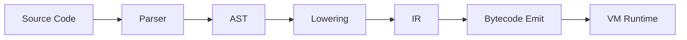
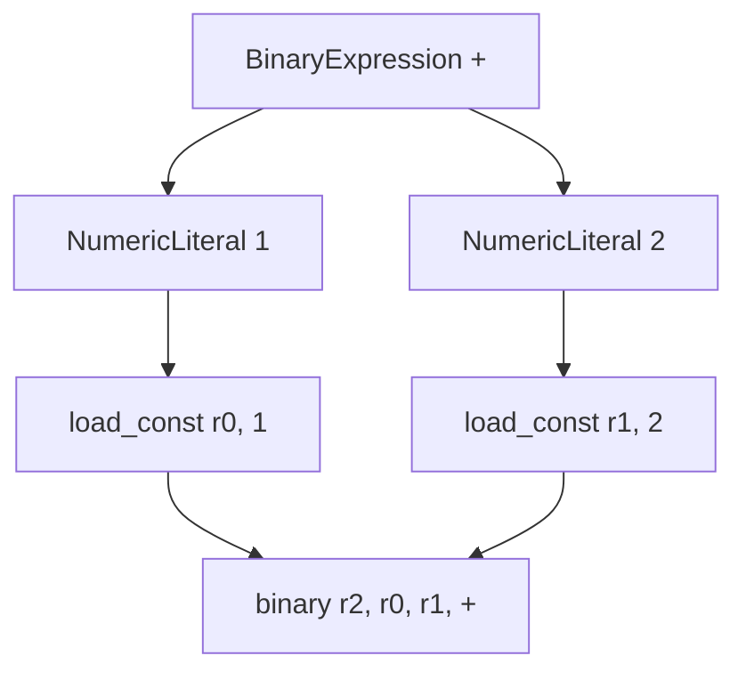
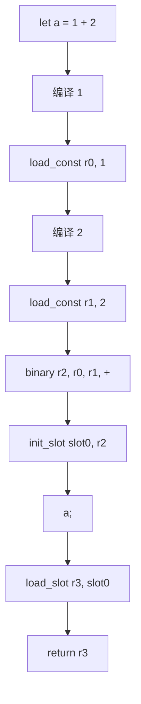

# 第 5 篇：写第一个编译器：从 AST 生成 IR

## 1. 本文目标

前四篇里，我们一直在手写 VM 指令或 bytecode。

例如：

```js
let a = 1 + 2;
a;
```

我们希望它最终变成类似下面的中间指令：

```text
load_const r0, 1
load_const r1, 2
binary r2, r0, r1, '+'
init_slot slot0, r2
load_slot r3, slot0
return r3
```

本篇要解决的问题是：

> 如何从 JavaScript 源码结构自动生成 VM 能理解的 IR？

我们会亲手实现一个极小编译器，支持：

1. 数字字面量；
2. 标识符读取；
3. 二元表达式；
4. `let` 变量声明；
5. 表达式语句；
6. 最后的隐式返回。

## 2. 为什么需要 AST 和 IR

到目前为止，我们写指令像是在手写菜谱：

```text
LOAD_CONST r0, const[0]
LOAD_CONST r1, const[1]
BINARY r2, r0, r1, '+'
```

但真正的用户只会写源码：

```js
let a = 1 + 2;
a;
```

所以我们需要一个“翻译员”：

```text
Source -> AST -> IR -> Bytecode -> Runtime
```

### 形象化比喻：从作文到施工图

JavaScript 源码像一篇作文，适合人读：

```text
先声明 a，它的值是 1 + 2，然后读取 a。
```

AST 像语文老师画出的句子结构：

```text
变量声明
  名字：a
  初始值：二元表达式
    左边：1
    右边：2
```

IR 像施工队真正拿去干活的步骤清单：

```text
r0 = 1
r1 = 2
r2 = r0 + r1
a = r2
r3 = a
return r3
```

AST 告诉我们“代码长什么样”，IR 告诉 VM “按什么顺序做”。

## 3. 前置知识

| 概念 | 说明 |
|---|---|
| Source | 用户写的 JS 源码 |
| AST | 抽象语法树，表达语法结构 |
| IR | 中间表示，表达执行顺序 |
| Lowering | 把 AST 降级成 IR 的过程 |
| Register | 保存表达式临时值 |
| Slot | 保存变量绑定 |

## 4. 源码中的对应位置

正式源码的编译流程中，`pipeline.ts` 会先 parse 和 normalize AST，再调用 `lowerToIR()`，然后才进入寄存器分配和 bytecode emit。

| 概念 | 源码位置 | 说明 |
|---|---|---|
| Parser | `src/compiler/frontend.ts` | 使用 Babel parser 生成 AST |
| Pipeline | `src/compiler/pipeline.ts` | 串起 parse、lower、emit、pack |
| IR 类型 | `src/compiler/ir.ts` | 定义 `IRInstruction` 与 `FunctionIR` |
| Lowering | `src/compiler/lowering.ts` | 把 AST 编译成 IR |
| 函数构建器 | `FunctionBuilder` | 分配寄存器、slot、发射 IR |

正式源码使用 `parseSource()` 调用 Babel parser，并配置一组 parser plugins。编译主流程随后调用 `normalizeAst(parseSource(...))` 和 `lowerToIR(file)`。

## 5. 核心数据结构

### 5.1 AST Node

#### 它解决什么问题

AST Node 表示源码的语法结构。

例如：

```js
1 + 2
```

可以想象成：

```js
{
  type: 'BinaryExpression',
  operator: '+',
  left: { type: 'NumericLiteral', value: 1 },
  right: { type: 'NumericLiteral', value: 2 },
}
```

#### 它的数据结构

教学版只需要支持少量节点：

```ts
type Expr =
  | { type: 'NumericLiteral'; value: number }
  | { type: 'Identifier'; name: string }
  | { type: 'BinaryExpression'; operator: string; left: Expr; right: Expr };
```

#### 它在源码中的对应位置

正式源码使用 Babel AST 类型，而不是我们手写的简化 AST。

#### 教学版简化实现

```js
const ast = {
  type: 'Program',
  body: [
    {
      type: 'ExpressionStatement',
      expression: {
        type: 'BinaryExpression',
        operator: '+',
        left: { type: 'NumericLiteral', value: 1 },
        right: { type: 'NumericLiteral', value: 2 },
      },
    },
  ],
};
```

#### 使用示例

```js
console.log(ast.body[0].expression.operator); // +
```

### 5.2 IRInstruction

#### 它解决什么问题

IRInstruction 把树状 AST 变成线性步骤。

例如 AST：

```text
BinaryExpression(+)
  1
  2
```

变成 IR：

```text
load_const r0, 1
load_const r1, 2
binary r2, r0, r1, '+'
```

#### 它的数据结构

教学版：

```ts
type IRInstruction =
  | { op: 'load_const'; dst: number; value: number }
  | { op: 'binary'; dst: number; left: number; right: number; operator: string }
  | { op: 'init_slot'; slot: number; src: number }
  | { op: 'load_slot'; dst: number; slot: number }
  | { op: 'return'; src: number };
```

#### 它在源码中的对应位置

正式源码的 `src/compiler/ir.ts` 定义了 `IRInstruction`，其中包含 `load_const`、`load_slot`、`init_slot`、`store_slot`、`binary`、`return` 等指令。

#### 教学版简化实现

```js
builder.emit({ op: 'load_const', dst: 0, value: 1 });
```

#### 使用示例

```js
console.log(ir[0].op); // load_const
```

### 5.3 FunctionBuilder

#### 它解决什么问题

编译时需要一个对象帮我们管理：

- 下一个寄存器编号；
- 下一个 slot 编号；
- 变量名到 slot 的映射；
- 生成出来的 IR 指令。

这个对象就是教学版 `FunctionBuilder`。

#### 它的数据结构

```js
class FunctionBuilder {
  constructor() {
    this.instructions = [];
    this.regCounter = 0;
    this.slotNames = [];
    this.bindings = new Map();
  }
}
```

#### 它在源码中的对应位置

正式源码的 `FunctionBuilder` 管理函数 ID、slot、IR、寄存器计数、label 计数、loop stack 等更多状态。

#### 教学版简化实现

```js
allocReg() {
  return this.regCounter++;
}
```

#### 使用示例

```js
const r0 = builder.allocReg();
```

## 6. Mermaid 图解

### 6.1 编译流程图



### 6.2 AST 到 IR



### 6.3 `let a = 1 + 2; a;` 编译流程



## 7. 伪代码

### 7.1 编译表达式

```text
function compileExpression(expr):
    if expr is NumericLiteral:
        dst = allocReg()
        emit load_const dst, expr.value
        return dst

    if expr is Identifier:
        dst = allocReg()
        slot = resolve expr.name
        emit load_slot dst, slot
        return dst

    if expr is BinaryExpression:
        left = compileExpression(expr.left)
        right = compileExpression(expr.right)
        dst = allocReg()
        emit binary dst, left, right, expr.operator
        return dst
```

### 7.2 编译语句

```text
function compileStatement(stmt):
    if stmt is VariableDeclaration:
        for each declaration:
            slot = declare declaration.name
            initReg = compileExpression(declaration.init)
            emit init_slot slot, initReg

    if stmt is ExpressionStatement:
        lastResult = compileExpression(stmt.expression)
```

### 7.3 编译 Program

```text
function compileProgram(program):
    builder = new FunctionBuilder()
    lastResult = undefined

    for each statement in program.body:
        lastResult = compileStatement(statement)

    emit return lastResult
    return builder.instructions
```

## 8. 教学版实现代码

```js
class FunctionBuilder {
  constructor() {
    this.instructions = [];
    this.regCounter = 0;
    this.slotNames = [];
    this.bindings = new Map();
  }

  allocReg() {
    return this.regCounter++;
  }

  declare(name) {
    if (this.bindings.has(name)) {
      return this.bindings.get(name);
    }

    const slot = this.slotNames.length;
    this.slotNames.push(name);
    this.bindings.set(name, slot);
    return slot;
  }

  resolve(name) {
    if (!this.bindings.has(name)) {
      throw new ReferenceError(`Unknown variable: ${name}`);
    }

    return this.bindings.get(name);
  }

  emit(instruction) {
    this.instructions.push(instruction);
  }
}

function compileExpression(expression, builder) {
  switch (expression.type) {
    case 'NumericLiteral': {
      const dst = builder.allocReg();
      builder.emit({ op: 'load_const', dst, value: expression.value });
      return dst;
    }

    case 'Identifier': {
      const dst = builder.allocReg();
      const slot = builder.resolve(expression.name);
      builder.emit({ op: 'load_slot', dst, slot });
      return dst;
    }

    case 'BinaryExpression': {
      const left = compileExpression(expression.left, builder);
      const right = compileExpression(expression.right, builder);
      const dst = builder.allocReg();
      builder.emit({ op: 'binary', dst, left, right, operator: expression.operator });
      return dst;
    }

    default:
      throw new Error(`Unsupported expression: ${expression.type}`);
  }
}

function compileStatement(statement, builder) {
  switch (statement.type) {
    case 'VariableDeclaration': {
      let last;

      for (const declaration of statement.declarations) {
        const slot = builder.declare(declaration.id.name);
        const init = compileExpression(declaration.init, builder);
        builder.emit({ op: 'init_slot', slot, src: init });
        last = init;
      }

      return last;
    }

    case 'ExpressionStatement':
      return compileExpression(statement.expression, builder);

    default:
      throw new Error(`Unsupported statement: ${statement.type}`);
  }
}

function compileProgram(program) {
  const builder = new FunctionBuilder();
  let lastResult;

  for (const statement of program.body) {
    lastResult = compileStatement(statement, builder);
  }

  builder.emit({ op: 'return', src: lastResult });

  return {
    instructions: builder.instructions,
    slotNames: builder.slotNames,
    registerCount: builder.regCounter,
  };
}
```

## 9. 示例输入与输出

### 示例 AST

```js
const ast = {
  type: 'Program',
  body: [
    {
      type: 'VariableDeclaration',
      declarations: [
        {
          id: { type: 'Identifier', name: 'a' },
          init: {
            type: 'BinaryExpression',
            operator: '+',
            left: { type: 'NumericLiteral', value: 1 },
            right: { type: 'NumericLiteral', value: 2 },
          },
        },
      ],
    },
    {
      type: 'ExpressionStatement',
      expression: { type: 'Identifier', name: 'a' },
    },
  ],
};
```

### 编译结果

```js
console.log(compileProgram(ast));
```

输出类似：

```js
{
  instructions: [
    { op: 'load_const', dst: 0, value: 1 },
    { op: 'load_const', dst: 1, value: 2 },
    { op: 'binary', dst: 2, left: 0, right: 1, operator: '+' },
    { op: 'init_slot', slot: 0, src: 2 },
    { op: 'load_slot', dst: 3, slot: 0 },
    { op: 'return', src: 3 }
  ],
  slotNames: ['a'],
  registerCount: 4
}
```

## 10. 执行过程拆解

| Step | AST 节点 | 编译动作 | 生成 IR |
|---|---|---|---|
| 1 | `NumericLiteral 1` | 分配 `r0` | `load_const r0, 1` |
| 2 | `NumericLiteral 2` | 分配 `r1` | `load_const r1, 2` |
| 3 | `BinaryExpression +` | 分配 `r2` | `binary r2, r0, r1, '+'` |
| 4 | `VariableDeclaration a` | 分配 `slot0` | `init_slot slot0, r2` |
| 5 | `Identifier a` | 分配 `r3` | `load_slot r3, slot0` |
| 6 | Program end | 返回最后结果 | `return r3` |

## 11. 与原始源码的差异

| 主题 | 教学版 | 正式源码 |
|---|---|---|
| Parser | 手写 AST | Babel parser |
| AST 范围 | 数字、标识符、二元表达式、变量声明 | 支持大量 JS 语法 |
| Scope | 单层 bindings | `ScopeFrame` 支持多层作用域 |
| Slot | 只记录 `slotNames` | 还记录 `slotKinds` |
| IR | 简化字段 | 正式 `IRInstruction` 包含更多 op |
| Return | Program 最后隐式 return | 正式源码根据模块导出和入口逻辑处理 |

正式源码在 `compileStatement()` 中处理变量声明：先解析 binding，再编译初始化表达式，随后根据 `var` / `let` / `const` 发射 `store_slot` 或 `init_slot`。表达式编译中，数字字面量会发射 `load_const`，标识符会发射 `load_slot` 或 `load_global`，二元表达式会递归编译左右表达式并发射 `binary`。

## 12. 常见问题

### Q1：AST 和 IR 为什么都需要？

AST 适合描述语法结构，IR 适合描述执行步骤。VM 不想遍历复杂语法树，它更喜欢线性指令。

### Q2：为什么 `compileExpression()` 要返回寄存器编号？

因为表达式的结果要被外层表达式或语句继续使用。返回寄存器编号，就是告诉调用者“结果放在哪里”。

### Q3：变量声明为什么先编译右侧表达式？

因为 `let a = 1 + 2` 要先算出 `1 + 2` 的结果，才能把结果写入 `a` 对应的 slot。

### Q4：这篇是不是已经能解析源码字符串了？

还不能。本文为了聚焦 lowering，手写了 AST。正式源码使用 Babel parser，下一步可以接入 parser，让字符串源码自动变成 AST。

## 13. 本文小结

这一篇我们实现了第一版编译器核心：

```text
AST -> IR
```

现在我们不再手写 IR，而是能从 AST 自动生成：

```text
load_const
binary
init_slot
load_slot
return
```

下一篇将继续讲：

```text
第 6 篇：把 IR 编成字节码：emit 与 label fixup
```
