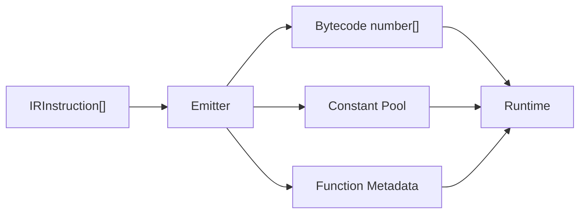
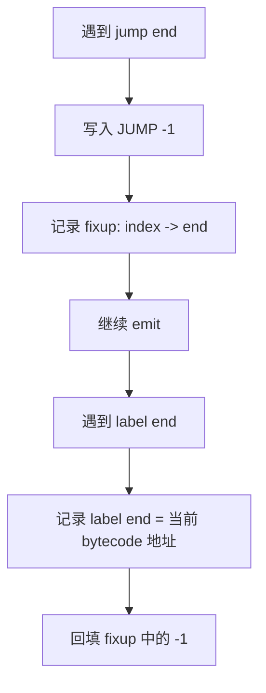

# 第 6 篇：把 IR 编成字节码：emit 与 label fixup

## 1. 本文目标

第 5 篇我们已经能把简化 AST 降级成 IR：

```text
load_const r0, 1
load_const r1, 2
binary r2, r0, r1, '+'
init_slot slot0, r2
load_slot r3, slot0
return r3
```

本篇继续向前走一步：

> 把人类可读的 IR 编码成 VM 可以顺序读取的数字 bytecode。

最终我们要得到：

```js
{
  bytecode: [4, 0, 0, 4, 1, 1, 13, 2, 0, 1, 1, 7, 0, 0, 2, 6, 3, 0, 0, 19, 3],
  constantPool: [1, 2]
}
```

这里的数字只是一种示意，正式源码中的 opcode 来自 `src/runtime/opcodes.ts`。

## 2. 为什么需要 emit 阶段

IR 像施工步骤清单：

```text
load_const r0, 1
binary r2, r0, r1, '+'
```

VM 更喜欢数字协议：

```text
4, 0, 0, 13, 2, 0, 1, 1
```

### 形象化比喻：把菜谱翻译成机器按钮

厨师看得懂：

```text
把鸡蛋打散，然后下锅翻炒。
```

自动炒菜机只认按钮编号：

```text
08, 12, 03, 21
```

`emit` 阶段就是把“菜谱语言”翻译成“机器按钮编号”。

## 3. 前置知识

| 概念 | 说明 |
|---|---|
| IR | 编译器内部的可读指令 |
| Bytecode | Runtime 消费的数字数组 |
| Constant Pool | 保存常量值，bytecode 引用索引 |
| Opcode | 指令编号 |
| Operand | opcode 后面的参数 |
| Label | 控制流目标的名字 |
| Fixup | 先占位，等 label 地址确定后回填 |

## 4. 源码中的对应位置

| 概念 | 源码位置 | 说明 |
|---|---|---|
| `emitBytecode()` | `src/compiler/emit.ts` | IR 到 bytecode 的主函数 |
| `ConstantPool` | `src/compiler/emit.ts` | 常量去重与索引分配 |
| `OPCODES` / `BINARY_OPS` | `src/runtime/opcodes.ts` | 指令和操作符数字编码 |
| `ProgramArtifact` | `src/compiler/types.ts` | 保存 bytecode、constantPool、functions |

正式源码的 `emitBytecode()` 遍历每个函数的 IR 指令，根据 `instruction.op` 向 `bytecode` 数组 push 数字；遇到 label 会记录地址，遇到 jump 会先写 `-1`，最后再 fixup。

## 5. 核心数据结构

### 5.1 Bytecode

#### 它解决什么问题

Bytecode 是 runtime 真正读取的程序格式。

#### 它的数据结构

```ts
type Bytecode = number[];
```

#### 教学版简化实现

```js
const bytecode = [];
bytecode.push(OPCODES.LOAD_CONST, 0, 0);
```

### 5.2 Constant Pool

#### 它解决什么问题

避免常量直接塞入 bytecode，让 bytecode 保持数字化。

#### 教学版简化实现

```js
class ConstantPool {
  constructor() {
    this.values = [];
    this.map = new Map();
  }

  add(value) {
    const key = JSON.stringify(value);
    if (this.map.has(key)) return this.map.get(key);
    const index = this.values.length;
    this.values.push(value);
    this.map.set(key, index);
    return index;
  }
}
```

### 5.3 ProgramArtifact

#### 它解决什么问题

把 runtime 需要的所有数据放进统一产物。

#### 教学版简化实现

```js
const artifact = {
  bytecode,
  constantPool: pool.values,
  registerCount,
  slotNames,
};
```

### 5.4 Label 与 Fixup

#### 它解决什么问题

跳转指令需要知道目标地址，但编译时目标 label 可能还没遇到。

#### 形象化比喻：先贴便签，最后填门牌号

你装修房子时先写：

```text
这里通向“厨房”
```

等厨房门牌号确定后，再把“厨房”换成真正地址。

#### 教学版简化实现

```js
fixups.push({ index: bytecode.length - 1, target: 'end' });
```

## 6. Mermaid 图解





## 7. 伪代码

```text
function emitBytecode(ir):
    pool = new ConstantPool()
    bytecode = []
    labels = Map()
    fixups = []

    for instruction in ir:
        if instruction.op is label:
            labels[instruction.name] = bytecode.length
            continue

        switch instruction.op:
            case load_const:
                index = pool.add(instruction.value)
                push LOAD_CONST, instruction.dst, index

            case binary:
                operator = BINARY_OPS[instruction.operator]
                push BINARY, dst, left, right, operator

            case jump:
                push JUMP, -1
                remember fixup

    for each fixup:
        bytecode[fixup.index] = labels[fixup.target]

    return { bytecode, constantPool: pool.values }
```

## 8. 教学版实现代码

```js
const OPCODES = {
  LOAD_CONST: 4,
  LOAD_SLOT: 6,
  INIT_SLOT: 7,
  BINARY: 13,
  JUMP: 15,
  RETURN: 19,
};

const BINARY_OPS = { '+': 1, '-': 2, '*': 3, '/': 4 };

class ConstantPool {
  constructor() {
    this.values = [];
    this.map = new Map();
  }

  add(value) {
    const key = JSON.stringify(value);
    if (this.map.has(key)) return this.map.get(key);
    const index = this.values.length;
    this.values.push(value);
    this.map.set(key, index);
    return index;
  }
}

function emitBytecode(ir) {
  const pool = new ConstantPool();
  const bytecode = [];
  const labels = new Map();
  const fixups = [];

  for (const instruction of ir) {
    if (instruction.op === 'label') {
      labels.set(instruction.name, bytecode.length);
      continue;
    }

    switch (instruction.op) {
      case 'load_const':
        bytecode.push(OPCODES.LOAD_CONST, instruction.dst, pool.add(instruction.value));
        break;

      case 'load_slot':
        bytecode.push(OPCODES.LOAD_SLOT, instruction.dst, 0, instruction.slot);
        break;

      case 'init_slot':
        bytecode.push(OPCODES.INIT_SLOT, 0, instruction.slot, instruction.src);
        break;

      case 'binary':
        bytecode.push(
          OPCODES.BINARY,
          instruction.dst,
          instruction.left,
          instruction.right,
          BINARY_OPS[instruction.operator]
        );
        break;

      case 'jump':
        bytecode.push(OPCODES.JUMP, -1);
        fixups.push({ index: bytecode.length - 1, target: instruction.target });
        break;

      case 'return':
        bytecode.push(OPCODES.RETURN, instruction.src);
        break;

      default:
        throw new Error(`Unsupported IR op: ${instruction.op}`);
    }
  }

  for (const fixup of fixups) {
    const target = labels.get(fixup.target);
    if (target === undefined) throw new Error(`Unknown label: ${fixup.target}`);
    bytecode[fixup.index] = target;
  }

  return { bytecode, constantPool: pool.values };
}
```

## 9. 示例输入与输出

### IR 输入

```js
const ir = [
  { op: 'load_const', dst: 0, value: 1 },
  { op: 'load_const', dst: 1, value: 2 },
  { op: 'binary', dst: 2, left: 0, right: 1, operator: '+' },
  { op: 'return', src: 2 },
];
```

### 输出

```js
{
  bytecode: [4, 0, 0, 4, 1, 1, 13, 2, 0, 1, 1, 19, 2],
  constantPool: [1, 2]
}
```

## 10. 执行过程拆解

| Step | IR | Bytecode 变化 | Constant Pool |
|---|---|---|---|
| 1 | `load_const r0, 1` | `[4, 0, 0]` | `[1]` |
| 2 | `load_const r1, 2` | `[4, 0, 0, 4, 1, 1]` | `[1, 2]` |
| 3 | `binary r2, r0, r1, +` | `[..., 13, 2, 0, 1, 1]` | `[1, 2]` |
| 4 | `return r2` | `[..., 19, 2]` | `[1, 2]` |

## 11. 与原始源码的差异

| 主题 | 教学版 | 正式源码 |
|---|---|---|
| 函数数量 | 单函数 | 多函数统一 bytecode |
| FunctionMeta | 简化 | 记录 entry/end/registerCount/slot 信息 |
| Label | 只演示 jump | 支持 jump、条件跳转、try 等 fixup |
| 操作符 | 只支持四则运算 | 支持更多 JS 二元 / 一元操作 |
| Debug | 无 | 可输出 debugInfo.instructions |

## 12. 常见问题

### Q1：为什么 bytecode 不直接保存字符串操作符？

因为 runtime 更适合消费数字协议，操作符也可以通过表映射成数字。

### Q2：为什么 label 不能一开始就知道地址？

因为 bytecode 是线性生成的，跳转目标可能在后面才出现。

### Q3：emit 阶段是不是优化阶段？

本系列里不是。emit 主要负责编码，优化可以放在 IR 阶段或单独优化阶段。

## 13. 本文小结

本文完成：

```text
IR -> Bytecode + ConstantPool
```

下一篇将继续讲：

```text
第 7 篇：控制流：if、while 与 jump
```
