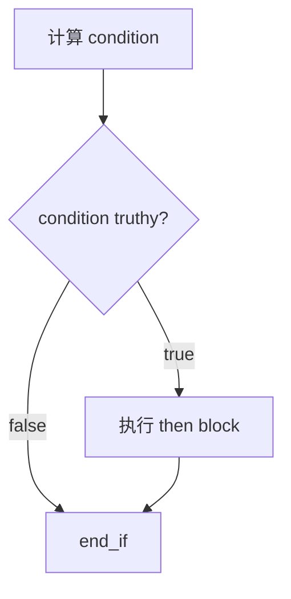
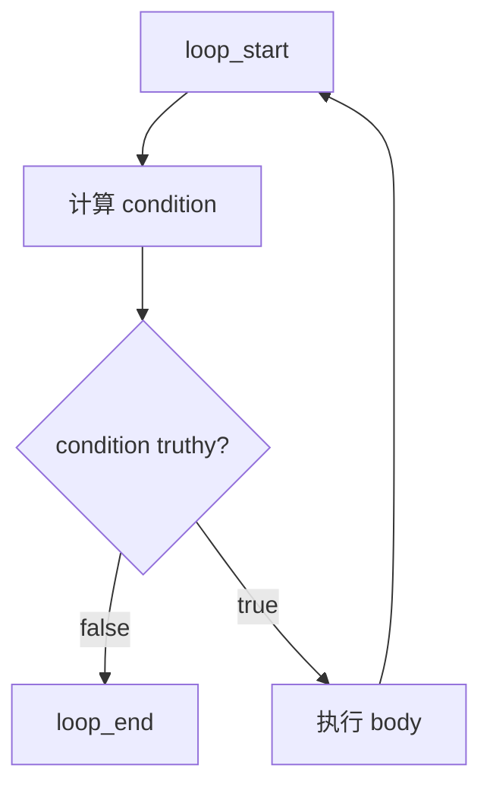

# 第 7 篇：控制流：if、while 与 jump

## 1. 本文目标

前面我们已经能编译和执行直线代码：

```js
let a = 1 + 2;
a;
```

但真实程序会分支和循环：

```js
let x = 1;
if (x) {
  x = 2;
}
x;
```

本篇目标是让 VM 支持控制流：

1. `label`
2. `jump`
3. `jump_if_false`
4. `if`
5. `while`

## 2. 为什么控制流需要 jump

直线代码像一条直路：

```text
1 -> 2 -> 3 -> 4
```

`if` 和 `while` 像岔路和回环：

```text
如果条件成立，走 A 路；否则跳到 B 路。
```

### 形象化比喻：游戏地图传送门

程序计数器 `pc` 像玩家在地图上的位置。普通指令让玩家向前走一步。`jump` 像传送门：

```text
不走下一格，直接传送到某个 label。
```

`jump_if_false` 像条件传送门：

```text
如果钥匙不对，就传送到出口。
```

## 3. 前置知识

| 概念 | 说明 |
|---|---|
| Label | 给 bytecode 某个位置起名 |
| Jump | 无条件跳转 |
| Conditional Jump | 条件不满足时跳转 |
| Basic Block | 一段顺序执行的指令 |
| Control Flow Graph | 基本块之间的跳转关系 |

## 4. 源码中的对应位置

| 概念 | 源码位置 | 说明 |
|---|---|---|
| `jump` / `jump_if_false` | `src/compiler/ir.ts` | IR 控制流指令 |
| label / fixup | `src/compiler/emit.ts` | label 记录地址，fixup 回填跳转目标 |
| runtime jump | `src/compiler/runtime-gen.ts` | 修改 `pc` 完成跳转 |
| lowering if/while | `src/compiler/lowering.ts` | 把高级语句降级成 label 和 jump |

## 5. 核心数据结构

### Label

#### 它解决什么问题

跳转目标先用名字表示，emit 后再变成数字地址。

#### 教学版简化实现

```js
{ op: 'label', name: 'end_if' }
```

### Jump

#### 它解决什么问题

让 VM 不再顺序执行下一条指令，而是把 `pc` 改成目标地址。

#### 教学版简化实现

```js
{ op: 'jump', target: 'loop_start' }
```

### Jump If False

#### 它解决什么问题

根据条件决定是否跳转。

#### 教学版简化实现

```js
{ op: 'jump_if_false', condition: 0, target: 'end_if' }
```

## 6. Mermaid 图解

### if 控制流



### while 控制流



## 7. 伪代码

### 编译 if

```text
compileIf(node):
    endLabel = newLabel('if_end')
    conditionReg = compileExpression(node.test)
    emit jump_if_false conditionReg, endLabel
    compileStatement(node.consequent)
    emit label endLabel
```

### 编译 while

```text
compileWhile(node):
    startLabel = newLabel('while_start')
    endLabel = newLabel('while_end')

    emit label startLabel
    conditionReg = compileExpression(node.test)
    emit jump_if_false conditionReg, endLabel
    compileStatement(node.body)
    emit jump startLabel
    emit label endLabel
```

## 8. 教学版实现代码

```js
function compileIf(node, builder) {
  const end = builder.label('if_end');
  const condition = compileExpression(node.test, builder);
  builder.emit({ op: 'jump_if_false', condition, target: end });
  compileStatement(node.consequent, builder);
  builder.emit({ op: 'label', name: end });
}

function compileWhile(node, builder) {
  const start = builder.label('while_start');
  const end = builder.label('while_end');

  builder.emit({ op: 'label', name: start });
  const condition = compileExpression(node.test, builder);
  builder.emit({ op: 'jump_if_false', condition, target: end });
  compileStatement(node.body, builder);
  builder.emit({ op: 'jump', target: start });
  builder.emit({ op: 'label', name: end });
}
```

### Runtime 执行 jump

```js
case OPCODES.JUMP:
  pc = bytecode[pc];
  break;

case OPCODES.JUMP_IF_FALSE: {
  const conditionReg = bytecode[pc++];
  const target = bytecode[pc++];
  if (!regs[conditionReg]) pc = target;
  break;
}
```

## 9. 示例输入与输出

```js
let x = 1;
if (x) {
  x = 2;
}
x;
```

简化 IR：

```text
load_const r0, 1
init_slot slot0, r0
load_slot r1, slot0
jump_if_false r1, if_end
load_const r2, 2
store_slot slot0, r2
label if_end
load_slot r3, slot0
return r3
```

输出：

```js
2
```

## 10. 执行过程拆解

| Step | Instruction | x | 说明 |
|---|---|---:|---|
| 1 | `load_const 1` | uninit | 准备初始值 |
| 2 | `init_slot x` | 1 | 初始化 x |
| 3 | `load_slot x` | 1 | 读取条件 |
| 4 | `jump_if_false` | 1 | 条件为真，不跳 |
| 5 | `store_slot x = 2` | 2 | 更新 x |
| 6 | `return x` | 2 | 返回 2 |

## 11. 与原始源码的差异

| 主题 | 教学版 | 正式源码 |
|---|---|---|
| if | 只支持 then | 支持 alternate |
| while | 基本循环 | 还处理 break/continue/label |
| label | 字符串 label | 带函数 ID 的 label 命名 |
| jump fixup | 简化 | emit 阶段统一回填 |
| truthy | `!value` | 使用 JS truthiness |

## 12. 常见问题

### Q1：为什么不能直接把 if 编成一个 JS if？

因为 VM 执行的是 bytecode，不是源码。控制流必须变成 `pc` 的变化。

### Q2：label 是 runtime 真的存在的指令吗？

不是。label 是编译期标记，emit 阶段会被移除，只留下数字地址。

## 13. 本文小结

本文让 VM 从直线执行升级到控制流执行。

下一篇将继续讲：

```text
第 8 篇：函数调用：参数、返回值与调用帧
```
