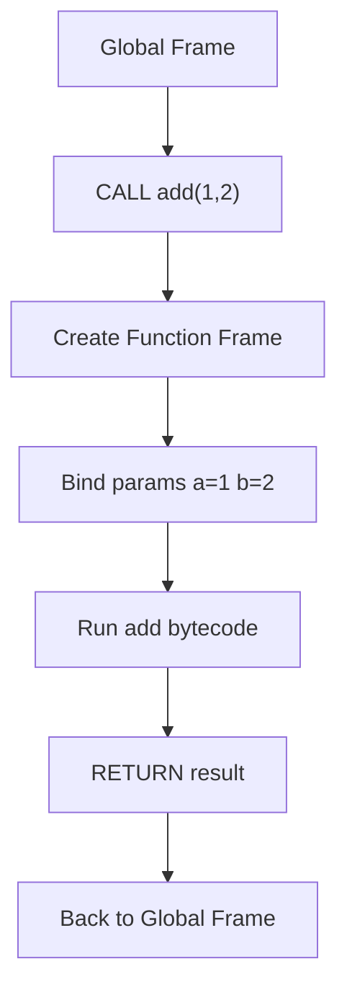
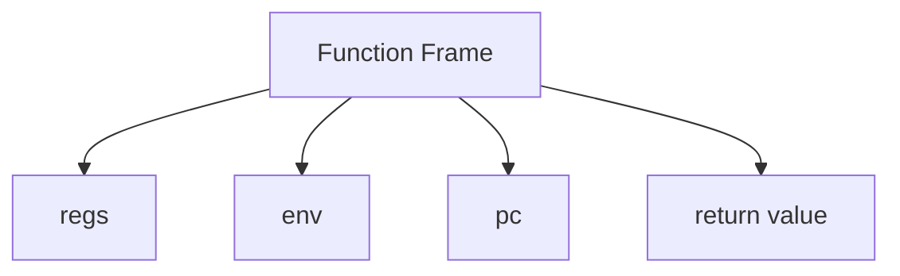

# 第 8 篇：函数调用：参数、返回值与调用帧

## 1. 本文目标

现在 VM 已经支持表达式、变量和控制流。下一步是函数：

```js
function add(a, b) {
  return a + b;
}

add(1, 2);
```

本篇要实现：

1. Function Object
2. FunctionMeta
3. Call Frame
4. 参数传递
5. Return Address / Return Completion
6. `CALL` 和 `RETURN`

## 2. 为什么函数调用更复杂

函数不是简单跳转。调用函数时，VM 需要创建一套新的运行时状态：

```text
新的 registers
新的 environment
新的参数绑定
函数自己的 pc 范围
返回值
```

### 形象化比喻：派一个分队去完成任务

主程序像总部，函数像临时派出的分队。

总部给分队：

```text
任务说明：add
物资：1 和 2
返回地点：总部
```

分队独立工作，完成后带着结果回来。

## 3. 前置知识

| 概念 | 说明 |
|---|---|
| Function Object | 可调用的运行时对象 |
| FunctionMeta | 函数的 bytecode 边界和寄存器信息 |
| Call Frame | 一次函数调用的运行时状态 |
| Parameter Slot | 参数绑定位置 |
| Return Value | 函数执行结果 |
| Return Address | 调用结束后回到哪里 |

## 4. 源码中的对应位置

| 概念 | 源码位置 | 说明 |
|---|---|---|
| `FunctionMeta` | `src/compiler/types.ts` | 函数元信息 |
| `MAKE_FUNCTION` | `src/runtime/opcodes.ts` | 创建函数对象 |
| `CALL` | `src/runtime/opcodes.ts` | 函数调用 |
| `RETURN` | `src/runtime/opcodes.ts` | 返回值 |
| `createClosure()` | `src/compiler/runtime-gen.ts` | 创建捕获环境的 JS 函数 |
| `executeSync()` | `src/compiler/runtime-gen.ts` | 执行一个函数的 bytecode |

## 5. 核心数据结构

### FunctionMeta

#### 它解决什么问题

告诉 runtime 函数的 bytecode 在哪里、需要多少寄存器、有哪些参数和 slot。

#### 教学版简化实现

```js
const fnMeta = {
  id: 1,
  name: 'add',
  entry: 0,
  end: 10,
  registerCount: 4,
  params: ['a', 'b'],
};
```

### Function Object

#### 它解决什么问题

把函数 ID 和捕获环境包装成可调用对象。

#### 教学版简化实现

```js
function createFunction(functionId, env) {
  return { type: 'function', functionId, env };
}
```

### Call Frame

#### 它解决什么问题

保存一次函数调用的独立状态。

#### 教学版简化实现

```js
const frame = {
  regs: new Array(meta.registerCount),
  env: createEnv(meta.slotNames, meta.slotKinds, parentEnv),
  pc: meta.entry,
};
```

## 6. Mermaid 图解





## 7. 伪代码

```text
function callFunction(fn, args):
    meta = functions[fn.functionId]
    env = createEnv(meta)
    bind params into env
    regs = new Array(meta.registerCount)
    pc = meta.entry
    run until RETURN
    return returned value
```

## 8. 教学版实现代码

```js
function createFunction(functionId, parentEnv) {
  return { type: 'function', functionId, parentEnv };
}

function executeFunction(metadata, functionId, parentEnv, args) {
  const meta = metadata.functions[functionId];
  const env = createEnv(meta.slotNames, meta.slotKinds, parentEnv);
  const regs = new Array(meta.registerCount);

  for (let i = 0; i < meta.params.length; i++) {
    env.values[i] = args[i];
    env.states[i] = true;
  }

  return runRange(metadata.bytecode, metadata.constantPool, meta.entry, meta.end, regs, env);
}

function callValue(metadata, value, args) {
  if (value.type !== 'function') throw new TypeError('not callable');
  return executeFunction(metadata, value.functionId, value.parentEnv, args);
}
```

## 9. 示例输入与输出

```js
function add(a, b) {
  return a + b;
}

add(1, 2);
```

简化 IR：

```text
make_function r0, function#1
load_const r1, 1
load_const r2, 2
call r3, r0, [r1, r2]
return r3

function#1 add:
load_slot r0, slot0(a)
load_slot r1, slot1(b)
binary r2, r0, r1, '+'
return r2
```

输出：

```js
3
```

## 10. 执行过程拆解

| Step | Frame | Instruction | 说明 |
|---|---|---|---|
| 1 | global | `make_function add` | 创建函数对象 |
| 2 | global | `call add(1,2)` | 创建 add frame |
| 3 | add | bind params | `a=1`, `b=2` |
| 4 | add | `binary a+b` | 得到 3 |
| 5 | add | `return 3` | 返回 global |
| 6 | global | `return result` | 程序结果 3 |

## 11. 与原始源码的差异

| 主题 | 教学版 | 正式源码 |
|---|---|---|
| Function Object | 普通对象 | `createClosure()` 返回 JS function |
| Return Address | 概念解释 | 借助 JS 调用栈和 completion |
| this | 不支持 | `CALL` 包含 `thisReg` |
| arguments | 不支持 | env 保存 args |
| async/generator | 不支持 | 正式 runtime 有多套 execute 函数 |

## 12. 常见问题

### Q1：为什么函数需要新的 frame？

因为每次调用都有自己的局部变量、参数和临时值。

### Q2：返回地址在哪里？

传统 VM 会显式保存 return address。当前项目生成 JS runtime，很多返回行为由宿主 JS 调用栈承载。

## 13. 本文小结

函数调用让 VM 拥有了组合能力。

下一篇将继续讲：

```text
第 9 篇：闭包：函数如何记住外部变量
```
