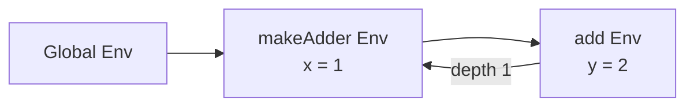
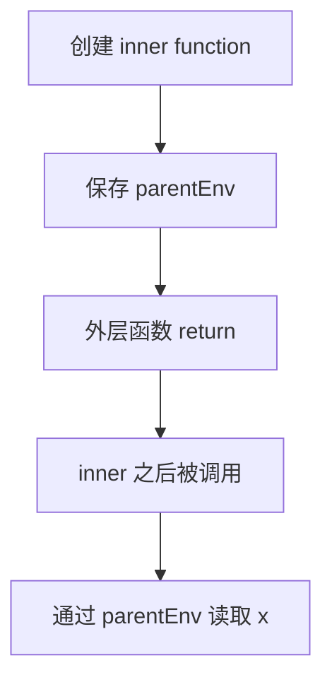

# 第 9 篇：闭包：函数如何记住外部变量

## 1. 本文目标

本篇实现闭包：

```js
function makeAdder(x) {
  return function add(y) {
    return x + y;
  };
}

const add1 = makeAdder(1);
add1(2); // 3
```

核心问题：

> 内层函数执行时，为什么还能读取外层函数已经创建过的变量 `x`？

## 2. 为什么闭包需要环境捕获

函数返回后，普通局部变量看似应该消失。但闭包要求外层变量继续可见。

### 形象化比喻：带走房间钥匙

外层函数像一间房，里面有储物柜 `x`。内层函数创建时，带走了这间房的钥匙。

外层函数结束后，房间没有被拆掉，因为还有函数拿着钥匙。

这把钥匙就是：

```text
parentEnv
```

## 3. 前置知识

| 概念 | 说明 |
|---|---|
| Closure | 函数 + 捕获环境 |
| Scope Chain | 多个 env 通过 parent 串起来 |
| Depth | 从当前 env 向外走几层 |
| Captured Environment | 函数创建时保存的环境引用 |

## 4. 源码中的对应位置

| 概念 | 源码位置 | 说明 |
|---|---|---|
| `ScopeFrame.parent` | `src/compiler/lowering.ts` | 编译期作用域链 |
| `resolve()` | `src/compiler/lowering.ts` | 计算变量所在 depth 和 slot |
| `createClosure()` | `src/compiler/runtime-gen.ts` | 创建捕获 parentEnv 的函数 |
| `resolveEnv()` | `src/compiler/runtime-gen.ts` | 运行时按 depth 找外层 env |
| `MAKE_FUNCTION` | `src/runtime/opcodes.ts` | 创建函数对象 |

## 5. 核心数据结构

### Closure

#### 它解决什么问题

把函数代码和它创建时所在的环境绑在一起。

#### 教学版简化实现

```js
function createClosure(functionId, parentEnv) {
  return { type: 'closure', functionId, parentEnv };
}
```

### Scope Chain

#### 它解决什么问题

支持从内层作用域向外层作用域查找变量。

#### 教学版简化实现

```js
function resolveEnv(env, depth) {
  let current = env;
  while (depth > 0) {
    current = current.parent;
    depth--;
  }
  return current;
}
```

### BindingRef

#### 它解决什么问题

编译期把变量名解析成 `{ depth, slot }`。

#### 教学版简化实现

```js
{ kind: 'slot', depth: 1, slot: 0 }
```

## 6. Mermaid 图解





## 7. 伪代码

```text
MAKE_FUNCTION functionId:
    closure = createClosure(functionId, currentEnv)
    regs[dst] = closure

LOAD_SLOT dst, depth, slot:
    targetEnv = resolveEnv(currentEnv, depth)
    regs[dst] = targetEnv.values[slot]
```

## 8. 教学版实现代码

```js
function createClosure(functionId, parentEnv) {
  return { type: 'closure', functionId, parentEnv };
}

function resolveEnv(env, depth) {
  let current = env;

  while (depth > 0) {
    current = current.parent;
    depth--;
  }

  return current;
}

function readSlot(env, depth, slot) {
  const target = resolveEnv(env, depth);
  return target.values[slot];
}
```

## 9. 示例输入与输出

```js
function outer() {
  let x = 1;
  return function inner() {
    return x;
  };
}

const fn = outer();
fn(); // 1
```

简化 IR：

```text
outer:
load_const r0, 1
init_slot slot0(x), r0
make_function r1, inner, parentEnv=current
return r1

inner:
load_slot r0, depth=1, slot0(x)
return r0
```

## 10. 执行过程拆解

| Step | 动作 | 环境 |
|---|---|---|
| 1 | 调用 outer | 创建 outer env |
| 2 | 初始化 x | outer env: `x=1` |
| 3 | 创建 inner | inner 捕获 outer env |
| 4 | outer 返回 inner | outer env 仍被引用 |
| 5 | 调用 inner | 创建 inner env，parent 指向 outer env |
| 6 | 读取 x | depth=1 找到 outer env |

## 11. 与原始源码的差异

| 主题 | 教学版 | 正式源码 |
|---|---|---|
| Closure | 普通对象 | `createClosure()` 返回 JS function |
| env 链 | 单纯 parent | 还携带 this、args、slotKinds |
| depth | 手写 | 编译期 `resolve()` 计算 |
| 函数种类 | 普通函数 | 支持 async/generator 等 |

## 12. 常见问题

### Q1：闭包捕获的是值还是变量？

捕获的是环境引用。因此如果外层变量之后被修改，闭包读取到的是修改后的值。

### Q2：外层函数结束后 env 为什么还存在？

因为闭包仍然引用它，垃圾回收不会释放仍可达的对象。

## 13. 本文小结

闭包 = 函数代码 + 创建时的环境。

下一篇将继续讲：

```text
第 10 篇：对象、数组与属性访问
```
