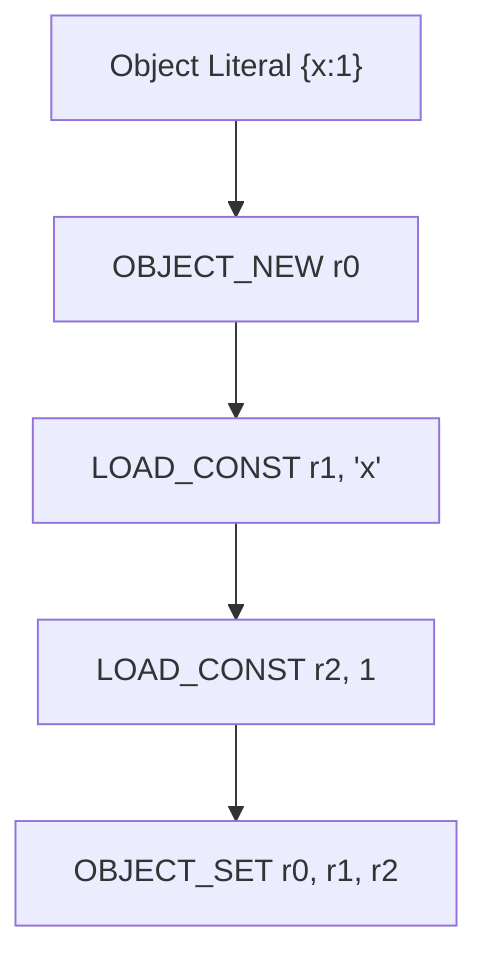
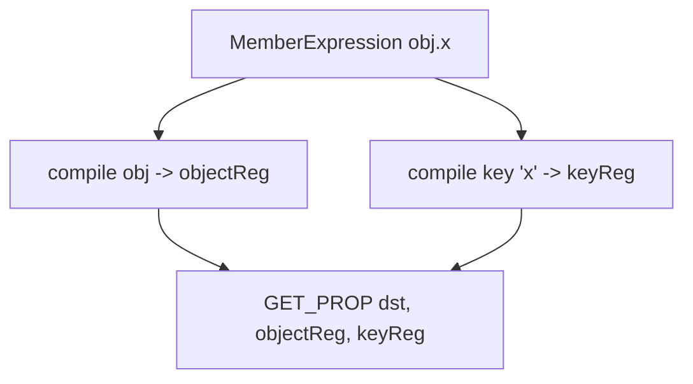

# 第 10 篇：对象、数组与属性访问

## 1. 本文目标

本篇让 VM 支持对象和数组：

```js
let obj = { x: 1 };
obj.x;

let arr = [1, 2];
arr[0];
```

需要新增：

1. `OBJECT_NEW`
2. `OBJECT_SET`
3. `ARRAY_NEW`
4. `ARRAY_PUSH`
5. `GET_PROP`
6. `SET_PROP`
7. `NEW`

## 2. 为什么对象需要运行时能力

数字和字符串是值。对象是容器。

对象属性访问：

```js
obj.x
```

不是简单读取变量 `x`，而是：

```text
先得到 obj
再得到属性名 'x'
再执行 obj['x']
```

### 形象化比喻：文件柜和抽屉标签

对象像文件柜，属性名像抽屉标签：

```text
obj 文件柜
  x 抽屉 -> 1
  y 抽屉 -> 2
```

`obj.x` 就是去 `obj` 文件柜里找 `x` 抽屉。

## 3. 前置知识

| 概念 | 说明 |
|---|---|
| Object | 属性键值表 |
| Property Key | 字符串或 symbol，这里先简化为字符串 |
| MemberExpression | `obj.x` 或 `obj[x]` |
| Array | 有序元素集合 |
| Constructor | 可被 `new` 调用的函数 |

## 4. 源码中的对应位置

| 概念 | 源码位置 | 说明 |
|---|---|---|
| `GET_PROP` / `SET_PROP` | `src/runtime/opcodes.ts` | 属性读写 opcode |
| `OBJECT_NEW` / `OBJECT_SET` | `src/runtime/opcodes.ts` | 对象字面量 |
| `ARRAY_NEW` / `ARRAY_PUSH` | `src/runtime/opcodes.ts` | 数组字面量 |
| `NEW` | `src/runtime/opcodes.ts` | 构造调用 |
| runtime cases | `src/compiler/runtime-gen.ts` | 实际执行属性读写和构造 |
| lowering object/array/member | `src/compiler/lowering.ts` | AST 到 IR |

## 5. 核心数据结构

### Object Value

#### 它解决什么问题

保存属性键值对。

#### 教学版简化实现

```js
const obj = {};
obj['x'] = 1;
```

### Property Access

#### 它解决什么问题

把 `obj.x` 表示为运行时读属性。

#### 教学版简化实现

```js
regs[dst] = regs[objectReg][regs[propertyReg]];
```

### Array Value

#### 它解决什么问题

保存有序元素。

#### 教学版简化实现

```js
const arr = [];
arr.push(1);
```

## 6. Mermaid 图解





## 7. 伪代码

```text
compileObjectExpression(obj):
    dst = allocReg()
    emit object_new dst
    for each property:
        key = compile key
        value = compile value
        emit object_set dst, key, value
    return dst

compileMemberExpression(expr):
    object = compile expr.object
    property = compile property key
    dst = allocReg()
    emit get_prop dst, object, property
    return dst
```

## 8. 教学版实现代码

```js
const OPCODES = {
  OBJECT_NEW: 1,
  OBJECT_SET: 2,
  ARRAY_NEW: 3,
  ARRAY_PUSH: 4,
  GET_PROP: 5,
  SET_PROP: 6,
};

function executeObjectOpcode(opcode, code, state) {
  const { regs } = state;

  switch (opcode) {
    case OPCODES.OBJECT_NEW: {
      const dst = code[state.pc++];
      regs[dst] = {};
      break;
    }

    case OPCODES.OBJECT_SET: {
      const object = regs[code[state.pc++]];
      const key = regs[code[state.pc++]];
      const value = regs[code[state.pc++]];
      object[key] = value;
      break;
    }

    case OPCODES.GET_PROP: {
      const dst = code[state.pc++];
      const object = regs[code[state.pc++]];
      const key = regs[code[state.pc++]];
      regs[dst] = object[key];
      break;
    }
  }
}
```

## 9. 示例输入与输出

```js
let obj = { x: 1 };
obj.x;
```

简化 IR：

```text
object_new r0
load_const r1, 'x'
load_const r2, 1
object_set r0, r1, r2
init_slot slot0(obj), r0
load_slot r3, slot0(obj)
load_const r4, 'x'
get_prop r5, r3, r4
return r5
```

输出：

```js
1
```

## 10. 执行过程拆解

| Step | Instruction | Object State |
|---|---|---|
| 1 | `object_new r0` | `{}` |
| 2 | `load_const 'x'` | `{}` |
| 3 | `load_const 1` | `{}` |
| 4 | `object_set r0, 'x', 1` | `{ x: 1 }` |
| 5 | `get_prop r5, r0, 'x'` | 返回 1 |

## 11. 与原始源码的差异

| 主题 | 教学版 | 正式源码 |
|---|---|---|
| 属性 key | 字符串 | 支持 computed key |
| 对象字面量 | 普通属性 | 还支持方法、getter/setter 转换 |
| 数组 | 简单 push | 还处理 holes、spread 脱糖 |
| new | 本篇只说明 | 正式 runtime 用 `Reflect.construct` |

## 12. 常见问题

### Q1：`obj.x` 和变量 `x` 一样吗？

不一样。变量 `x` 从 environment 读取，`obj.x` 从对象属性读取。

### Q2：为什么属性名也要放寄存器？

因为属性名可能是表达式，例如 `obj[key]`。

## 13. 本文小结

本篇让 VM 支持运行时对象容器。

下一篇将继续讲：

```text
第 11 篇：打包、模块与 CLI
```
