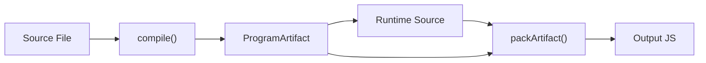
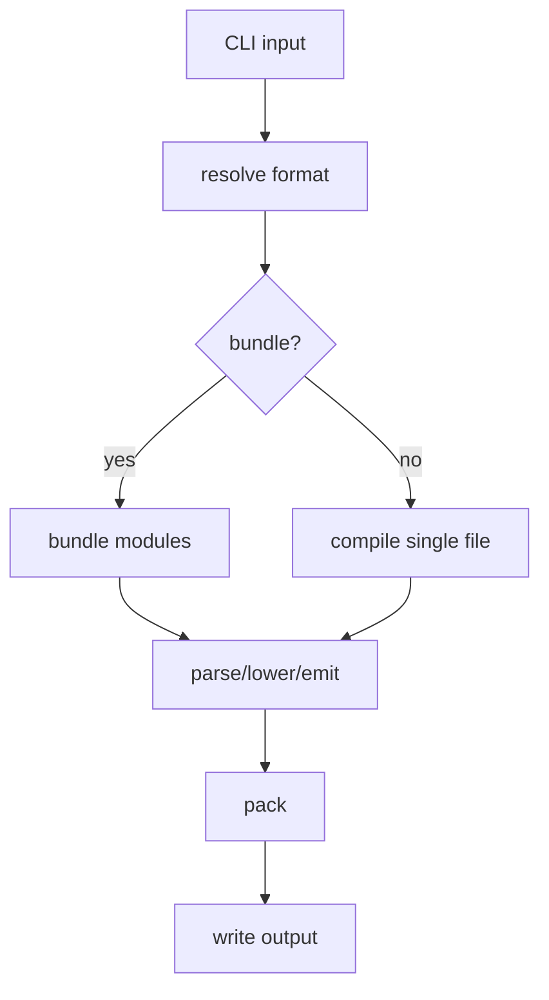

# 第 11 篇：打包、模块与 CLI：把 VM 产物变成可运行文件

## 1. 本文目标

前面我们已经拥有编译器和 runtime 的核心部件。现在要解决工程化问题：

> 如何把 bytecode、constantPool、函数元信息和 runtime 打包成一个可运行 JS 文件？

本篇覆盖：

1. `ProgramArtifact`
2. Runtime Source
3. Pack
4. IIFE / CJS / ESM 包装
5. Module Bundling
6. CLI
7. Debug Info

## 2. 为什么需要打包

如果只生成 bytecode：

```js
[4, 0, 0, 19, 0]
```

用户不能直接运行。

还需要 runtime：

```js
function __scriptvmRun(metadata, globalObject) { ... }
```

以及 metadata：

```js
{
  bytecode,
  constantPool,
  functions
}
```

### 形象化比喻：游戏卡带

bytecode 像游戏关卡数据，runtime 像游戏机，metadata 像说明书。打包就是把它们装进一张卡带，用户插上就能运行。

## 3. 前置知识

| 概念 | 说明 |
|---|---|
| Artifact | 编译产物数据 |
| Runtime | 执行 bytecode 的解释器 |
| Pack | 把 runtime 与 artifact 拼成 JS |
| IIFE | 立即执行函数表达式 |
| CJS | CommonJS 输出 |
| ESM | ES Module 输出 |
| CLI | 命令行入口 |

## 4. 源码中的对应位置

| 概念 | 源码位置 | 说明 |
|---|---|---|
| `compile()` | `src/compiler/pipeline.ts` | 主编译流程 |
| `ProgramArtifact` | `src/compiler/types.ts` | bytecode 与元数据结构 |
| `generateRuntimeSource()` | `src/compiler/runtime-gen.ts` | 生成运行时源码 |
| `packArtifact()` | `src/compiler/pack.ts` | 打包 runtime + metadata |
| `bundle()` | `src/compiler/bundler.ts` | 模块打包 |
| CLI | `src/cli.ts` | 命令行参数与入口 |

## 5. 核心数据结构

### ProgramArtifact

#### 它解决什么问题

把 runtime 需要的一切数据集中保存。

#### 教学版简化实现

```js
const artifact = {
  format: 'iife',
  bytecode: [],
  constantPool: [],
  functions: [],
  entryFunctionId: 0,
};
```

### Runtime Source

#### 它解决什么问题

提供一个解释 bytecode 的函数。

#### 教学版简化实现

```js
function generateRuntimeSource() {
  return `function __run(metadata){ return 0 }`;
}
```

### Packed Output

#### 它解决什么问题

让用户得到一个可直接运行的 JS 文件。

#### 教学版简化实现

```js
const output = `
(function(){
  const metadata = ${JSON.stringify(artifact)};
  ${runtimeSource}
  return __run(metadata);
})()
`;
```

## 6. Mermaid 图解





## 7. 伪代码

```text
function compile(inputFile, outputFile, options):
    source = read inputFile
    format = resolveFormat(source)

    if bundle enabled:
        source = bundle(source)

    ast = parse(source)
    ir = lower(ast)
    bytecode = emit(ir)
    runtime = generateRuntimeSource()
    code = pack(runtime, bytecode)

    write outputFile
    return code
```

## 8. 教学版实现代码

```js
function packArtifact(artifact) {
  const metadata = JSON.stringify(artifact);

  return `
(function () {
  function __miniRun(metadata) {
    const code = metadata.bytecode;
    const pool = metadata.constantPool;
    const regs = [];
    let pc = 0;

    while (pc < code.length) {
      const op = code[pc++];
      if (op === 4) regs[code[pc++]] = pool[code[pc++]];
      else if (op === 19) return regs[code[pc++]];
      else throw new Error('unknown opcode: ' + op);
    }
  }

  return __miniRun(${metadata});
})()
`.trim();
}
```

## 9. 示例输入与输出

### Artifact

```js
const artifact = {
  bytecode: [4, 0, 0, 19, 0],
  constantPool: [42],
};
```

### Packed Output

```js
const code = packArtifact(artifact);
console.log(eval(code)); // 42
```

## 10. 执行过程拆解

| Step | 阶段 | 产物 |
|---|---|---|
| 1 | parse/lower/emit | `ProgramArtifact` |
| 2 | generate runtime | `__scriptvmRun` 源码 |
| 3 | pack | 自包含 JS 文件 |
| 4 | execute output | VM runtime 执行 bytecode |
| 5 | return | 输出结果 |

## 11. 与原始源码的差异

| 主题 | 教学版 | 正式源码 |
|---|---|---|
| Runtime | 极简同步执行 | 支持 sync/async/generator |
| Format | 只演示 IIFE | 支持 IIFE/ESM/CJS |
| Module | 不支持 | 支持 ESM/CJS bundling |
| Global | 简化 | 注入 `__vm_global`、require/module/exports |
| Debug | 不支持 | 可包含 debugInfo |

## 12. 常见问题

### Q1：为什么 output 仍然是 JS？

因为这个项目是 JS virtualization：bytecode 由自定义 JS runtime 解释，最终产物仍然可以被 JS 引擎运行。

### Q2：打包是不是混淆？

不是。打包只是把 runtime 和 metadata 放到一起。混淆属于额外阶段。

## 13. 本文小结

本篇完成从“编译数据”到“可运行产物”的工程闭环。

下一篇将继续讲：

```text
第 12 篇：完整最小 JSVM 实现与源码设计复盘
```
