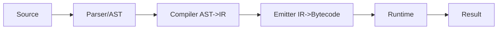
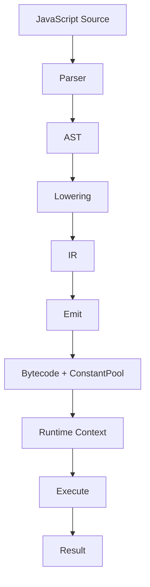

# 第 12 篇：完整最小 JSVM 实现与源码设计复盘

## 1. 本文目标

最后一篇，我们把前面所有零件合成一台完整最小 JSVM。

至少支持：

- 数字常量
- 字符串常量
- 加减乘除
- 变量声明
- 变量读取
- 表达式执行
- 简单函数调用
- `return`
- 简单 `if`

示例：

```js
function add(a, b) {
  return a + b;
}

let x = add(1, 2);
x;
```

输出：

```js
3
```

## 2. 最小 JSVM 总览



### 形象化比喻：一条小型生产线

- Source：客户订单；
- AST：订单结构表；
- IR：生产步骤；
- Bytecode：机器按钮编号；
- Runtime：机器本体；
- Result：最终产品。

## 3. 支持语法范围

教学版最小实现支持：

| 能力 | 示例 |
|---|---|
| 数字 | `1` |
| 字符串 | `'a'` |
| 四则运算 | `1 + 2 * 3` |
| 变量声明 | `let a = 1` |
| 变量读取 | `a` |
| 函数声明 | `function add(a,b){...}` |
| 函数调用 | `add(1,2)` |
| return | `return a + b` |
| if | `if (x) { x = 2 }` |

不支持或作为扩展：

- 完整 JS parser；
- 完整块级作用域；
- 闭包完整语义；
- 对象和 class 完整语义；
- async/generator；
- module bundling。

## 4. 核心代码骨架

```js
const OPCODES = {
  LOAD_CONST: 1,
  LOAD_SLOT: 2,
  INIT_SLOT: 3,
  STORE_SLOT: 4,
  BINARY: 5,
  JUMP: 6,
  JUMP_IF_FALSE: 7,
  MAKE_FUNCTION: 8,
  CALL: 9,
  RETURN: 10,
};

const BINARY_OPS = {
  '+': 1,
  '-': 2,
  '*': 3,
  '/': 4,
};
```

## 5. Runtime 最小实现

```js
function binary(op, left, right) {
  switch (op) {
    case BINARY_OPS['+']: return left + right;
    case BINARY_OPS['-']: return left - right;
    case BINARY_OPS['*']: return left * right;
    case BINARY_OPS['/']: return left / right;
    default: throw new Error('bad op');
  }
}

function createEnv(slotNames, parent = null) {
  return {
    values: new Array(slotNames.length),
    states: new Array(slotNames.length).fill(false),
    slotNames,
    parent,
  };
}

function readSlot(env, slot) {
  if (!env.states[slot]) throw new ReferenceError(`${env.slotNames[slot]} not initialized`);
  return env.values[slot];
}

function writeSlot(env, slot, value, init) {
  if (!init && !env.states[slot]) throw new ReferenceError(`${env.slotNames[slot]} not initialized`);
  env.values[slot] = value;
  env.states[slot] = true;
}
```

## 6. 执行函数

```js
function execute(metadata, functionId, parentEnv, args = []) {
  const fn = metadata.functions[functionId];
  const env = createEnv(fn.slotNames, parentEnv);
  const regs = new Array(fn.registerCount);
  const code = metadata.bytecode;

  for (let i = 0; i < fn.params.length; i++) {
    env.values[i] = args[i];
    env.states[i] = true;
  }

  let pc = fn.entry;

  while (pc < fn.end) {
    const op = code[pc++];

    switch (op) {
      case OPCODES.LOAD_CONST:
        regs[code[pc++]] = metadata.constantPool[code[pc++]];
        break;

      case OPCODES.LOAD_SLOT:
        regs[code[pc++]] = readSlot(env, code[pc++]);
        break;

      case OPCODES.INIT_SLOT:
        writeSlot(env, code[pc++], regs[code[pc++]], true);
        break;

      case OPCODES.STORE_SLOT:
        writeSlot(env, code[pc++], regs[code[pc++]], false);
        break;

      case OPCODES.BINARY: {
        const dst = code[pc++];
        const left = code[pc++];
        const right = code[pc++];
        const bop = code[pc++];
        regs[dst] = binary(bop, regs[left], regs[right]);
        break;
      }

      case OPCODES.JUMP:
        pc = code[pc];
        break;

      case OPCODES.JUMP_IF_FALSE: {
        const condition = regs[code[pc++]];
        const target = code[pc++];
        if (!condition) pc = target;
        break;
      }

      case OPCODES.MAKE_FUNCTION:
        regs[code[pc++]] = { functionId: code[pc++], parentEnv: env };
        break;

      case OPCODES.CALL: {
        const dst = code[pc++];
        const fnValue = regs[code[pc++]];
        const argc = code[pc++];
        const argv = [];
        for (let i = 0; i < argc; i++) argv.push(regs[code[pc++]]);
        regs[dst] = execute(metadata, fnValue.functionId, fnValue.parentEnv, argv);
        break;
      }

      case OPCODES.RETURN:
        return regs[code[pc++]];

      default:
        throw new Error(`unknown opcode ${op}`);
    }
  }
}
```

## 7. 示例 Artifact

```js
const metadata = {
  constantPool: [1, 2],
  functions: [
    {
      id: 0,
      name: null,
      entry: 0,
      end: 17,
      registerCount: 4,
      slotNames: ['add', 'x'],
      params: [],
    },
    {
      id: 1,
      name: 'add',
      entry: 17,
      end: 26,
      registerCount: 3,
      slotNames: ['a', 'b'],
      params: ['a', 'b'],
    },
  ],
  bytecode: [
    OPCODES.MAKE_FUNCTION, 0, 1,
    OPCODES.INIT_SLOT, 0, 0,
    OPCODES.LOAD_SLOT, 1, 0,
    OPCODES.LOAD_CONST, 2, 0,
    OPCODES.LOAD_CONST, 3, 1,
    OPCODES.CALL, 2, 1, 2, 2, 3,
    OPCODES.INIT_SLOT, 1, 2,
    OPCODES.LOAD_SLOT, 3, 1,
    OPCODES.RETURN, 3,

    OPCODES.LOAD_SLOT, 0, 0,
    OPCODES.LOAD_SLOT, 1, 1,
    OPCODES.BINARY, 2, 0, 1, BINARY_OPS['+'],
    OPCODES.RETURN, 2,
  ],
};
```

## 8. run(source) 的位置

真正完整的 `run(source)` 需要 parser。教学版可以把 `parse` 简化为“输入已知示例时返回固定 AST”：

```js
function runKnownProgram() {
  return execute(metadata, 0, null, []);
}

console.log(runKnownProgram()); // 3
```

如果要扩展成真正 `run(source)`，需要接入 parser：

```text
source -> parse -> AST -> compile -> IR -> emit -> metadata -> execute
```

## 9. 测试用例

教学版目标测试：

```js
run('1 + 2') === 3;
run('let a = 1; a;') === 1;
run('let a = 1 + 2; a;') === 3;
run('function add(a, b) { return a + b; } add(1, 2);') === 3;
run('let x = 1; if (x) { x = 2; } x;') === 2;
```

如果当前教学代码还没有完整 parser，这些可以作为扩展任务逐步完成。

## 10. 源码设计复盘

| 教学版 | 正式源码 |
|---|---|
| 手写 / 简化 AST | Babel parser |
| 简化 FunctionBuilder | 完整 `FunctionBuilder` / `ScopeFrame` |
| 简化 IR | `src/compiler/ir.ts` |
| 简化 emit | `src/compiler/emit.ts` |
| 单一同步 runtime | `runtime-gen.ts` 中 sync/async/generator runtime |
| 简化 pack | `src/compiler/pack.ts` |
| 无 bundler | `src/compiler/bundler.ts` |

## 11. 安全与设计提醒

JSVM 并不是安全沙箱。即使源码被编成 bytecode，runtime 仍然在宿主 JS 环境中执行。如果暴露 `globalObject`、`require`、`import` 或原型对象，仍然可能产生任意代码执行、原型污染或沙箱逃逸风险。

教学版不要声称具备安全隔离能力。正式工程若要用于不可信代码，需要单独设计沙箱边界。

## 12. Mermaid 总复盘



## 13. 本文小结

至此，我们从 0 到 1 搭出了一台最小 JSVM：

1. 最小栈式 VM；
2. 数字 bytecode 与 constant pool；
3. 寄存器式 VM；
4. slot、environment 与 TDZ；
5. AST 到 IR；
6. IR 到 bytecode；
7. 控制流；
8. 函数调用；
9. 闭包；
10. 对象和属性访问；
11. 打包输出；
12. 完整最小复盘。

后续可以继续扩展：

- 完整 parser；
- 更完整的作用域链；
- 对象 / class 完整语义；
- async / generator；
- module bundling；
- 调试器；
- 混淆和保护策略。
